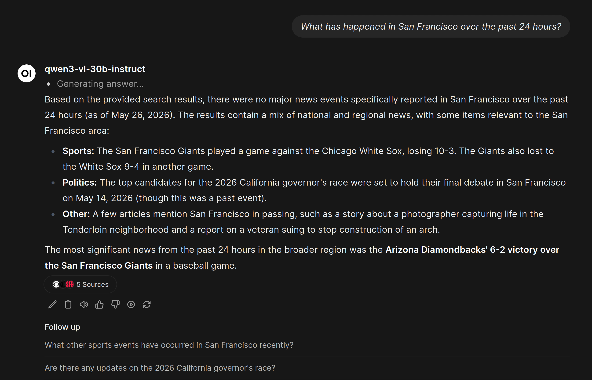
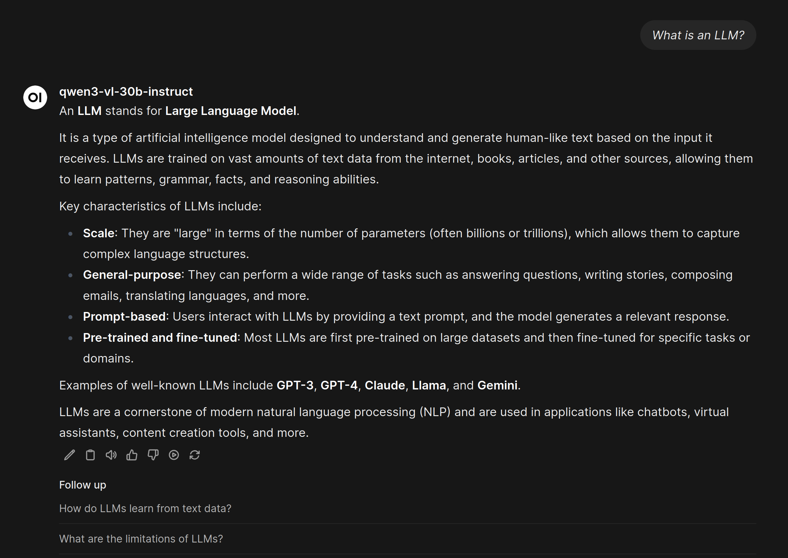
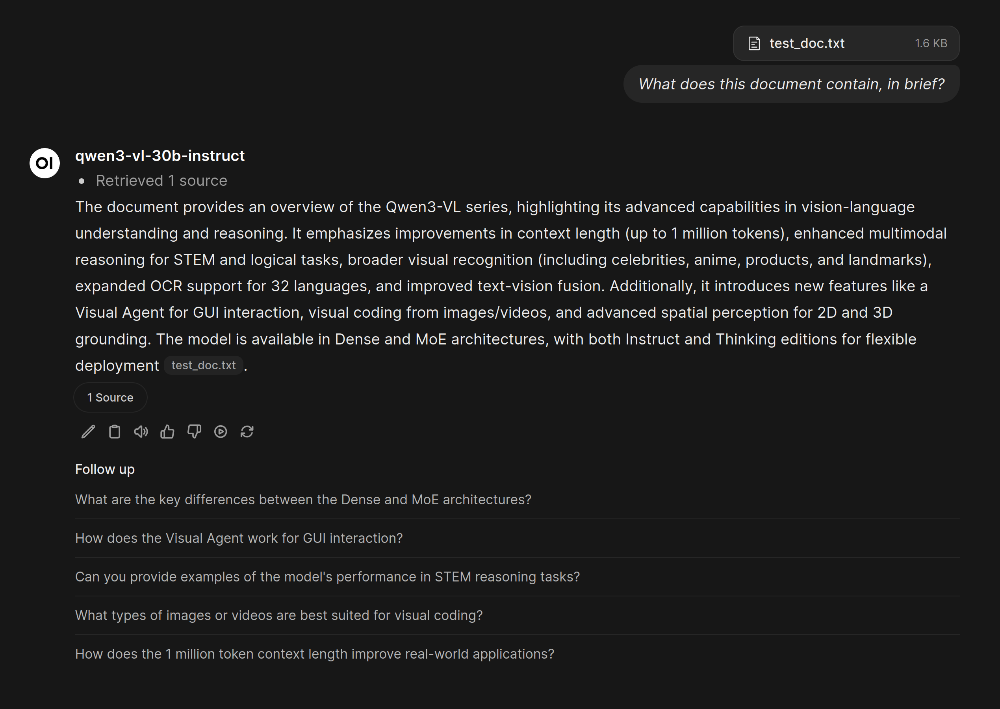
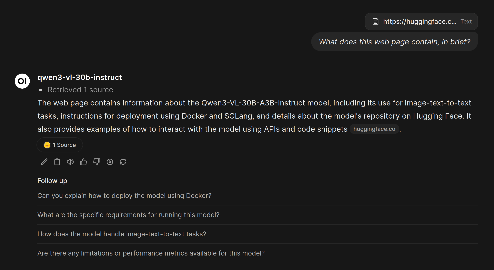
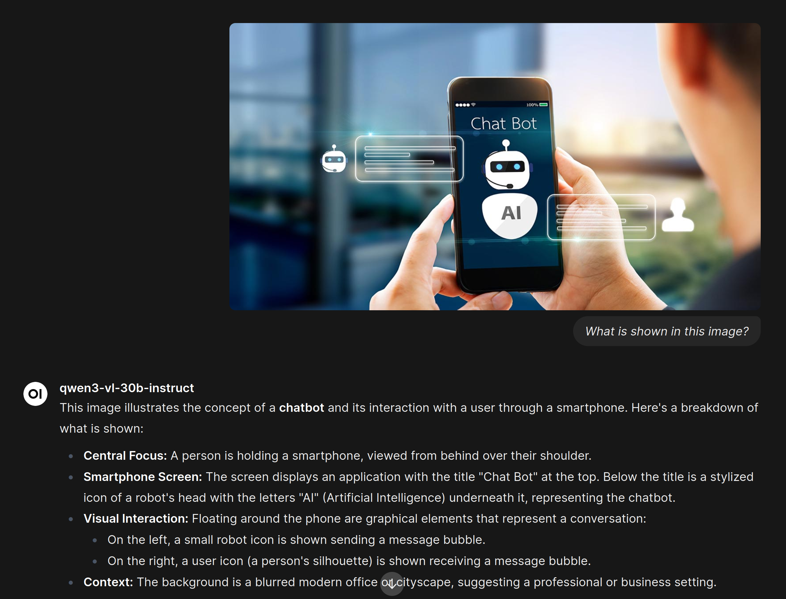
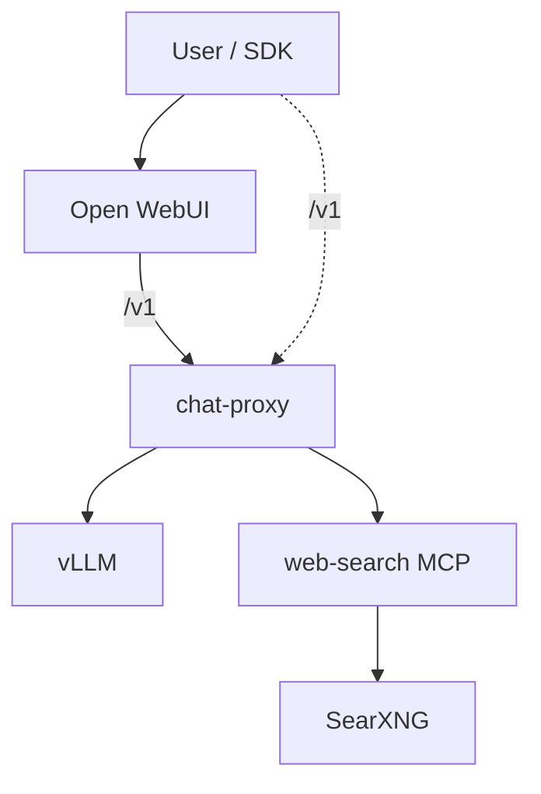

# chat-ai

Public **reference implementation** for a self-hosted AI platform: a FastAPI **chat-proxy** as the public API boundary, with **vLLM** for inference, **hosted web search** (SearXNG + Playwright via MCP), and **Open WebUI** for the browser UI.

SDK clients and Open WebUI target **chat-proxy** (`/v1/chat/completions`, `/v1/models`). vLLM, web-search MCP, and SearXNG are internal services behind that boundary.

The stack exposes an **OpenAI Chat Completions-compatible** backend — not the full OpenAI Platform API.

## Highlights

| Area | What it does |
|------|----------------|
| **Unified API** | `POST /v1/chat/completions` and `GET /v1/models` — OpenAI Chat Completions shape |
| **Hosted web search** | `tools: [{ "type": "web_search" }]` — router LLM, SearXNG, URL filter, page fetch, citations (`url_citation` + SSE for Open WebUI) |
| **Client tools** | `type: "function"` forwarded to vLLM (Hermes parser → `tool_calls`) |
| **Vision** | Multimodal messages (`image_url`) when the deployed vLLM model supports vision |
| **Optional reasoning** | `reasoning.enabled` → `enable_thinking` on vLLM (when the model supports it) |
| **Streaming** | SSE passthrough for chat/tools/reasoning; orchestrated status + citation events for web search |
| **MCP integration bus** | System tools call dedicated MCP HTTP servers; web-search is the first |

## Deployment profiles

| Profile | Purpose | Documentation |
|---------|---------|---------------|
| **Local development** | Single-machine quick start, smoke tests, portfolio/demo | This README (quick start) · [docs/ARCHITECTURE.md](docs/ARCHITECTURE.md) |
| **Reference deployment** | Production-oriented patterns: sizing, ports, exposure, ops | [docs/PRODUCTION.md](docs/PRODUCTION.md) |

Both profiles use the same architecture. Values such as model id, ports, cache paths, and GPU layout are **operator-selected** via `.env` and Compose — see `.env.example` and `docker-compose.yml`.

## Screenshots

Open WebUI → **chat-proxy** → vLLM (example model id from local defaults). More images: [`docs/images/`](docs/images/README.md).

### Hosted web search (proxy `web_search` tool)

Answer with source citations from the orchestrated search pipeline:



### Plain chat



### Document in chat

Uploaded text file summarized by the vision-language model:



### URL in chat

Web page summarized from a link in the message:



### Vision smoke input

Sample image used by `tests/smoke/check_proxy_vision.sh` (multimodal `image_url`):



## Architecture



**Public:** Open WebUI (browser UI), chat-proxy (`/v1/chat/completions`, `/v1/models`).

**Internal:** vLLM, web-search MCP, SearXNG (Docker network only; local Compose also binds debug host ports to `127.0.0.1` — see [docs/ARCHITECTURE.md](docs/ARCHITECTURE.md)).

Details: [docs/ARCHITECTURE.md](docs/ARCHITECTURE.md) · Decision log: [docs/DECISIONS.md](docs/DECISIONS.md) · File map: [docs/INDEX.md](docs/INDEX.md)

## Stack

- **Inference:** [vLLM](https://docs.vllm.ai/) — OpenAI-compatible model API served to chat-proxy
- **Proxy:** Python 3.12, FastAPI, httpx, Pydantic (onion: `core` / `operations` / `adapters`)
- **Search:** SearXNG, Playwright, [MCP](https://modelcontextprotocol.io/) streamable HTTP
- **UI:** [Open WebUI](https://github.com/open-webui/open-webui) v0.6.32 + optional Filter for proxy web search
- **Deploy:** Docker Compose

Default local Compose uses a vision-language model configured via `VLLM_HF_MODEL` and `VLLM_SERVED_MODEL` in `.env` (see `.env.example`). Operators choose any vLLM-supported model for their hardware.

## Requirements (local development profile)

- Linux host with **NVIDIA GPU** and drivers compatible with CUDA 12.x runtime images
- Enough VRAM for your chosen model and context length
- Docker Engine with NVIDIA Container Toolkit
- Hugging Face cache path with model weights (`HF_CACHE_ROOT`, `HF_HUB_CACHE` in `.env`)

## Quick start (local development)

```bash
cp .env.example .env
# Set HF_CACHE_ROOT, HF_HUB_CACHE, SEARXNG_SECRET for your machine
docker compose up -d --build
```

Open WebUI: `http://localhost:${OPEN_WEBUI_PORT:-13000}` (port from `.env`).

Chat-proxy API (use this for SDK clients and Open WebUI): `http://localhost:${CHAT_PROXY_PORT:-18080}/v1`.

chat-proxy supports optional static API key authentication via `CHAT_PROXY_API_KEY`. When unset or empty (the default), `/v1/models` and `/v1/chat/completions` accept requests without credentials. When set, clients must send `Authorization: Bearer <key>`. `GET /health` stays unauthenticated for health checks. Set `OPENAI_API_KEY` to the same value for SDK clients; Docker Compose wires Open WebUI automatically. This is a simple self-hosted API key — not user accounts or SaaS IAM. For internet-exposed deployments, set `CHAT_PROXY_API_KEY` or place chat-proxy behind a gateway or reverse proxy.

Direct vLLM access (`VLLM_PORT`, localhost only) is for smoke/debug — not the public application API.

Smoke tests (stack must be healthy; load `.env` first):

```bash
set -a && source .env && set +a
./tests/smoke/run_proxy_contract_smoke.sh
```

See [tests/smoke/README.md](tests/smoke/README.md) for individual checks (plain chat, streaming, functions, web search, vision).

### Open WebUI web search (optional)

Import the filter from [`open_webui/functions/proxy_web_search_filter.py`](open_webui/functions/proxy_web_search_filter.py), disable OWUI built-in Web Search, enable model **Citations** + **Status Updates**. Setup: [open_webui/README.md](open_webui/README.md).

## Local development (without Docker)

```bash
uv sync
uv run pytest
uv run chat-proxy   # needs vLLM + MCP URLs in env
```

## API modes (summary)

| Mode | Trigger | Proxy |
|------|---------|--------|
| Plain / vision | No tools | Passthrough to vLLM |
| Functions | `tools[].type == "function"` | vLLM `tool_calls` |
| Web search | `tools[].type == "web_search"` | Full pipeline + annotations |
| Reasoning | `reasoning.enabled` | vLLM `enable_thinking` |

**Not supported:** `/v1/responses`, Assistants API, Images API, Files API; multiple system tools per request; mixing `web_search` with `function` tools in one request (`400 conflicting_tools`).

Example web search tool (`user_location` required):

```json
{
  "type": "web_search",
  "search_context_size": "medium",
  "user_location": {
    "type": "approximate",
    "approximate": {
      "country": "US",
      "city": "New York",
      "region": "New York",
      "timezone": "America/New_York"
    }
  }
}
```

SearXNG locale (`en` / `ru`) is inferred from the **user message script** (Cyrillic → `ru`, Latin → `en`), not from `user_location`. Russian (and other Cyrillic) user queries are fully supported.

## Project layout

| Path | Role |
|------|------|
| `src/adapters/` | FastAPI app, vLLM client, MCP client |
| `src/operations/` | Routing, web search pipeline, streaming helpers |
| `src/web_search/` | Embedded search/fetch module + MCP server |
| `open_webui/` | OWUI filter for UI web search |
| `docs/` | Architecture, reference deployment, plans, decisions |
| `tests/` | Unit tests + `tests/smoke/` contract scripts |

## License

Portfolio reference implementation — source is provided for learning and evaluation. There is no `LICENSE` file; obtain permission before redistribution or public forking.
