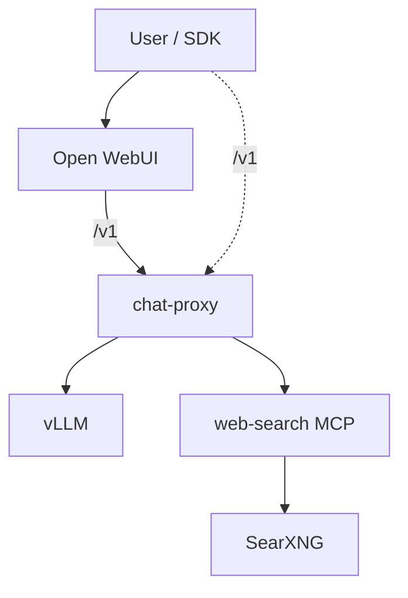

# chat-ai

Self-hosted **OpenAI-compatible chat stack**: a FastAPI **chat-proxy** in front of **vLLM** (Qwen3-VL), **hosted web search** (SearXNG + Playwright via MCP), and **Open WebUI** for the browser UI.

Designed for a single-GPU workstation or server: one public HTTP API for apps and UI, with inference and search isolated behind adapters.

## Highlights

| Area | What it does |
|------|----------------|
| **Unified API** | `POST /v1/chat/completions` and `GET /v1/models` — OpenAI Chat shape, not the full Platform API |
| **Hosted web search** | `tools: [{ "type": "web_search" }]` — router LLM, SearXNG, URL filter, page fetch, citations (`url_citation` + SSE for Open WebUI) |
| **Client tools** | `type: "function"` forwarded to vLLM (Hermes parser → `tool_calls`) |
| **Vision** | Qwen3-VL multimodal messages (`image_url`) |
| **Optional reasoning** | `reasoning.enabled` → `enable_thinking` on vLLM (hybrid VL-Instruct) |
| **Streaming** | SSE passthrough for chat/tools/reasoning; orchestrated status + citation events for web search |
| **MCP integration bus** | System tools call dedicated MCP HTTP servers; web-search is the first |

## Screenshots

Open WebUI → **chat-proxy** → vLLM (model `qwen3-vl-30b-instruct`). More images: [`docs/images/`](docs/images/README.md).

### Hosted web search (proxy `web_search` tool)

Answer with source citations from the orchestrated search pipeline:


### Plain chat


### Document in chat

Uploaded text file summarized by the vision-language model:


### URL in chat

Web page summarized from a link in the message:


### Vision smoke input

Sample image used by `tests/smoke/check_proxy_vision.sh` (multimodal `image_url`):


## Architecture



Details: [docs/ARCHITECTURE.md](docs/ARCHITECTURE.md) · Decision log: [docs/DECISIONS.md](docs/DECISIONS.md) · File map: [docs/INDEX.md](docs/INDEX.md)

## Stack

- **Inference:** [vLLM](https://docs.vllm.ai/) `v0.12.x`, `Qwen/Qwen3-VL-30B-A3B-Instruct`
- **Proxy:** Python 3.12, FastAPI, httpx, Pydantic (onion: `core` / `operations` / `adapters`)
- **Search:** SearXNG, Playwright, [MCP](https://modelcontextprotocol.io/) streamable HTTP
- **UI:** [Open WebUI](https://github.com/open-webui/open-webui) v0.6.32 + optional Filter for proxy web search
- **Deploy:** Docker Compose

## Requirements

- Linux host with **NVIDIA GPU** and drivers compatible with CUDA 12.x runtime images
- Enough VRAM for Qwen3-VL-30B (~32K context at `gpu_memory_utilization=0.9` on a ~80GB-class GPU)
- Docker Engine with NVIDIA Container Toolkit
- Hugging Face cache with model weights (first start downloads or uses existing cache)

## Quick start

```bash
cp .env.example .env
# Set HF_CACHE_ROOT, HF_HUB_CACHE, SEARXNG_SECRET for your machine
docker compose up -d --build
```

Open WebUI: `http://localhost:${OPEN_WEBUI_PORT:-13000}` (port from `.env`).

Chat-proxy API: `http://localhost:${CHAT_PROXY_PORT:-18080}/v1`.

Smoke tests (stack must be healthy; load `.env` first):

```bash
set -a && source .env && set +a
./tests/smoke/run_proxy_contract_smoke.sh
```

See [tests/smoke/README.md](tests/smoke/README.md) for individual checks (plain chat, streaming, functions, web search, vision).

### Open WebUI web search (optional)

Import the filter from [`open_webui/functions/proxy_web_search_filter.py`](open_webui/functions/proxy_web_search_filter.py), disable OWUI built-in Web Search, enable model **Citations** + **Status Updates**. Setup: [open_webui/README.md](open_webui/README.md).

## Local development

```bash
uv sync
uv run pytest
uv run chat-proxy   # needs vLLM + MCP URLs in env
```

## API modes (summary)

| Mode | Trigger | Proxy |
|------|---------|--------|
| Plain / vision | No tools | Passthrough to vLLM |
| Functions | `tools[].type == "function"` | vLLM `tool_calls` |
| Web search | `tools[].type == "web_search"` | Full pipeline + annotations |
| Reasoning | `reasoning.enabled` | vLLM `enable_thinking` |

`web_search` and `function` tools cannot be mixed in one request (`400 conflicting_tools`).

Example web search tool ( `user_location` required):

```json
{
  "type": "web_search",
  "search_context_size": "medium",
  "user_location": {
    "type": "approximate",
    "approximate": {
      "country": "US",
      "city": "New York",
      "region": "New York",
      "timezone": "America/New_York"
    }
  }
}
```

SearXNG locale (`en` / `ru`) is inferred from the **user message script** (Cyrillic → `ru`, Latin → `en`), not from `user_location`. Russian (and other Cyrillic) user queries are fully supported.

## Project layout

| Path | Role |
|------|------|
| `src/adapters/` | FastAPI app, vLLM client, MCP client |
| `src/operations/` | Routing, web search pipeline, streaming helpers |
| `src/web_search/` | Embedded search/fetch module + MCP server |
| `open_webui/` | OWUI filter for UI web search |
| `docs/` | Architecture, plans, decisions |
| `tests/` | Unit tests + `tests/smoke/` contract scripts |

## License

Source is provided for portfolio and learning. Add a `LICENSE` file before redistribution if you fork this repo publicly.
