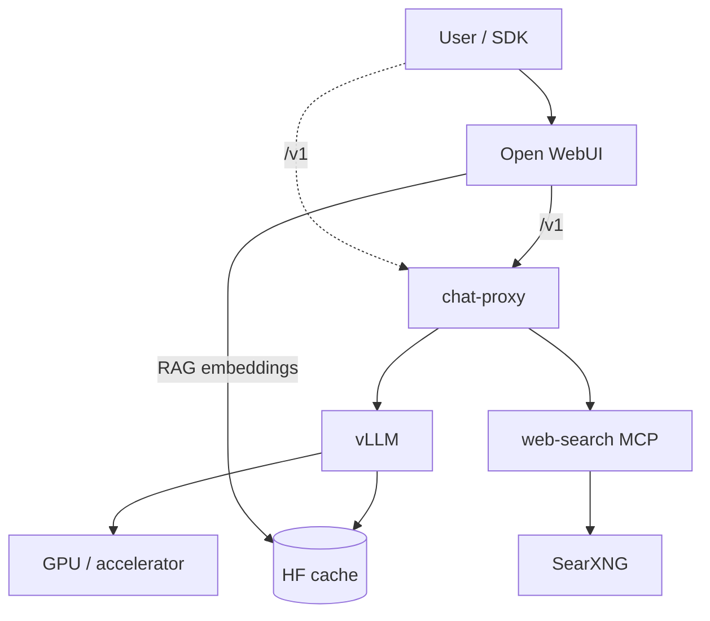

# Architecture

Current-state architecture for the **chat-ai** self-hosted AI platform reference implementation: **Open WebUI** + **chat-proxy** + **vLLM** + **web-search MCP** + **SearXNG**.

## System context

| Component | Role |
|-----------|------|
| **Open WebUI** | Public browser UI, chat sessions, RAG (local embeddings); OpenAI client → chat-proxy |
| **chat-proxy** | Public API boundary: `/v1/chat/completions`, `/v1/models`; validation, routing, system-tool orchestration |
| **vLLM** | Internal inference backend: OpenAI-compatible model API, Hermes tool calls, optional reasoning parser |
| **web-search (MCP HTTP)** | Internal MCP service: SearXNG + Playwright; tools `search_urls`, `fetch_page_markdown` |
| **SearXNG** | Internal metasearch HTTP API used by web-search MCP |
| **MCP stdio** | Local development / external MCP client path — not the proxy hot path in Compose deployments |

SDK clients and Open WebUI target **chat-proxy**. vLLM, MCP services, and SearXNG are implementation details for normal application use.

## Public interfaces and internal services

| Exposure | Service | Interface |
|----------|---------|-----------|
| **Public** | Open WebUI | Browser UI; configured to call chat-proxy as OpenAI API |
| **Public** | chat-proxy | `POST /v1/chat/completions`, `GET /v1/models` |
| **Internal** | vLLM | OpenAI-compatible HTTP API on Docker network (`vllm:8000`); optional `127.0.0.1` host port for local debug |
| **Internal** | web-search MCP | Streamable HTTP MCP at `http://web-search-mcp:3333/mcp` on Docker network; optional `127.0.0.1` host port for debug |
| **Internal** | SearXNG | Metasearch HTTP API on Docker network; optional `127.0.0.1` host port for debug |

Direct vLLM access from application clients is discouraged. Use chat-proxy for SDK and UI traffic.

**Local Compose port exposure:** vLLM, web-search MCP, and SearXNG host ports bind to `127.0.0.1` only (debug/smoke on the same machine). chat-proxy and Open WebUI bind on all interfaces. Reference deployments should remove internal host port mappings entirely or protect them behind a firewall.

**Authentication:** chat-proxy supports optional static API key auth via `CHAT_PROXY_API_KEY`. When unset or empty, `/v1/models` and `/v1/chat/completions` accept unauthenticated requests (local development default). When set, clients must send `Authorization: Bearer <key>`. `GET /health` remains open for health checks. Set `OPENAI_API_KEY` to the same value for SDK clients; Docker Compose wires Open WebUI from `CHAT_PROXY_API_KEY` when set. This is a single shared self-hosted key — not user identity, tenants, or enterprise IAM. Operators exposing the proxy beyond localhost should set `CHAT_PROXY_API_KEY` or terminate auth at a gateway.

## Compatibility boundary

The platform implements an **OpenAI Chat Completions-compatible** backend — not the full OpenAI Platform.

### Supported public API surface

| Endpoint | Purpose |
|----------|---------|
| `POST /v1/chat/completions` | Chat, tools, reasoning, streaming |
| `GET /v1/models` | List served model id(s) |

### Known limitations (not supported)

- `/v1/responses`
- Assistants API
- Images API
- Files API
- Multiple system tools per request
- Mixing hosted/system `web_search` with client `function` tools in one request (`400 conflicting_tools`)
- Combining `reasoning.enabled` with any `tools` (`400`)

## Deployment topology



Port numbers, model id, cache paths, and GPU layout are **operator-selected** via `.env` and `docker-compose.yml`. See [PRODUCTION.md](PRODUCTION.md) for reference deployment guidance.

**UI examples:** [images/README.md](images/README.md) · web search with citations:


---

## Deployment profiles

### Local development

Purpose: single-machine quick start, local development, smoke validation, portfolio/demo.

- Source of truth for defaults: `.env.example` and `docker-compose.yml`
- Configurable: `CHAT_PROXY_PORT`, `OPEN_WEBUI_PORT`, `VLLM_PORT`, `VLLM_HF_MODEL`, `VLLM_SERVED_MODEL`, HF cache paths
- Direct vLLM host port (`127.0.0.1` only) is for smoke/debug; SDK clients and Open WebUI use chat-proxy
- Default Compose profile targets a vision-language model suitable for local GPU capacity (see `docker-compose.yml`)

### Reference deployment

Purpose: reusable production-oriented patterns for operators running their own stack.

- Deployment dimensions: model size, context length, GPU/accelerator capacity, tensor parallelism, storage/cache paths, service ports, network exposure
- All infrastructure values are operator-selected — no canonical host, hardware layout, or model is assumed
- Operational guidance: [PRODUCTION.md](PRODUCTION.md)

---

## Chat proxy API

Single public surface: **OpenAI Chat Completions** shape.

### Request modes

| Mode | How enabled | Proxy behavior |
|------|-------------|----------------|
| **Plain chat** | No `tools`, no `reasoning.enabled` | Passthrough to vLLM (text + vision messages) |
| **Client functions** | `tools[]` with `type: "function"` only | vLLM → `tool_calls` to client |
| **System web search** | `tools[]` with `type: "web_search"` | Full pipeline on proxy; one final answer |
| **Reasoning** | `reasoning: { "enabled": true }`, no tools | vLLM `enable_thinking`; CoT typically in `content` (passthrough) |

**400 conflicts:**

- `web_search` (or any system tool) + `type: "function"` in the same request.
- `reasoning.enabled` + any `tools`.

### System tool: `web_search`

```json
{
  "type": "web_search",
  "search_context_size": "low" | "medium" | "high",
  "user_location": {
    "type": "approximate",
    "approximate": {
      "country": "US",
      "city": "New York",
      "region": "New York",
      "timezone": "America/New_York"
    }
  }
}
```

`user_location` is **required**. One system tool per request.

**Response:** `finish_reason: stop`, `message.content`, `message.annotations[]` with `url_citation` (not client-visible `tool_calls`).

**Pipeline:** router LLM → MCP `search_urls` (10) → LLM URL filter → MCP `fetch_page_markdown` (parallel) → final LLM → citations in `annotations` (non-stream) and OWUI `citation` events + streamed answer.

**Temporal grounding:** Final LLM only — `web_search_prompt.py` prepends an English `system` message with today's date (`datetime`, IANA timezone from `user_location.approximate.timezone`, else UTC) so the model treats the following `tool` block as live web evidence. Router, URL filter, SKIP, and no-hits paths are unchanged. Details: [plans/06-web-search-temporal-grounding.md](plans/06-web-search-temporal-grounding.md).

**SearXNG language:** from last user message (`search_locale.py`): Cyrillic ≥ Latin → `ru`; else `en`. MCP `search_urls` passes this as SearXNG `language` ([locale tags](https://docs.searxng.org/src/searx.locales.html): `en`, `ru`, …). **`user_location`** is required for the API tool shape (country/city/timezone) but does not set SearXNG locale.

### Client function calling

Standard OpenAI shape: proxy forwards `tools` to vLLM; returns `tool_calls` / `finish_reason: tool_calls`. Client executes functions and continues with `role: tool`.

### Reasoning (optional)

- Request: `reasoning.enabled: true` → `chat_template_kwargs.enable_thinking: true` on vLLM.
- Response: passthrough from vLLM. On models with hybrid thinking (e.g. Qwen3-VL-Instruct), chain-of-thought usually appears in `message.content`; `message.reasoning_content` is set only if vLLM exposes a separate `reasoning` field.
- Not combined with tools.
- Clients must **not** send `reasoning_content` in history (400).

### Streaming

| Mode | `stream: true` |
|------|----------------|
| Plain / vision | Passthrough vLLM SSE |
| Client `function` | Passthrough vLLM SSE (`tool_calls` deltas) |
| Reasoning | Passthrough + `enable_thinking` (no tag parsing on proxy) |
| `web_search` | Status + citation SSE events, then passthrough final vLLM stream |

**Open WebUI:** Progress and source chips use SSE `data: {"event": {"type": "status"|"citation", ...}}` from chat-proxy when `web_search` tool is in the request.

### Open WebUI → proxy `web_search`

| Path | Who adds `tools: web_search` | Notes |
|------|------------------------------|--------|
| **API / SDK** | Client in request body | Opt-in |
| **OWUI Filter** | `inlet` on active filter | Primary UI path; see `open_webui/functions/` |
| **OWUI built-in Web Search** | OWUI middleware (not proxy tool) | **Disable** when using Filter — duplicate SearXNG |

Filter appends `user_location` from Valves (OpenAI contract); proxy picks SearXNG `en`/`ru` from message text; orchestrated pipeline + SSE.

**OWUI v0.6.32:** Enable model **Citations** and **Status Updates** (Settings → Models → Capabilities) so proxy SSE status/citation lines render in chat; global Admin Web Search stays off. Details: [open_webui/README.md](../open_webui/README.md).

### Observability (chat-proxy)

**uvicorn access logs** plus application logs on stdout (Docker captures). Each `POST /v1/chat/completions` gets a **`request_id`** (UUID) on every line for that request.

| Config | Purpose |
|--------|---------|
| `CHAT_PROXY_LOG_LEVEL` | Default `INFO`; use `DEBUG` for MCP `duration_ms` |
| `CHAT_PROXY_LOG_JSON` | `true` → one JSON object per line (Loki-friendly) |

**Request:** `request_start` / `request_end` with `mode` (`plain`, `reasoning`, `function`, `web_search`), `tool_types`, `web_search_invoked`, `duration_ms`.

**web_search pipeline:** `web_search_start` → `router_result` (`SEARCH` \| `SKIP`) → `search_hits` / `search_no_hits` → `url_filter_result` → `fetch_results` → `web_search_complete`. No full `messages` or page markdown at INFO.

Operator check: `docker logs chat-proxy 2>&1 | grep request_id=…` or filter `search_hits`. Details: [plans/05-chat-proxy-logging.md](plans/05-chat-proxy-logging.md).

**Streaming (`stream: true`, OWUI default):** `request_id` is set in the route handler for `request_start`, then re-bound at the start of the SSE body generator (Starlette runs it in a separate async task). `request_end` and `reset_request_id` run in that same generator task so the stream is not torn down with `ValueError: Token was created in a different Context`.

---

## vLLM service (internal)

vLLM serves an **OpenAI-compatible model API** to chat-proxy. Operators configure model, context length, and GPU settings for their hardware.

| Setting | Typical configuration | Notes |
|---------|----------------------|--------|
| Image | `vllm/vllm-openai` (`VLLM_IMAGE_TAG`) | CUDA 12.x |
| Model (HF) | `VLLM_HF_MODEL` | Hugging Face model passed to vLLM (Compose `command`) |
| Served name | `VLLM_SERVED_MODEL` | vLLM `--served-model-name`; also `CHAT_PROXY_DEFAULT_MODEL` in Compose |
| Context | `max_model_len` in Compose | Size for VRAM and use case |
| GPU | `gpu_memory_utilization`, device map, tensor parallel | Scale with accelerator count and model size |
| Tool calling | `--enable-auto-tool-choice`, `--tool-call-parser hermes` | Client `function` tools |
| Reasoning | `--reasoning-parser` when model supports thinking | With `enable_thinking` per request |
| Multimodal | `--limit-mm-per-prompt.video 0` recommended | If video not used |

**Example (local defaults):** `Qwen/Qwen3-VL-30B-A3B-Instruct` with served id `qwen3-vl-30b-instruct` — suitable for a single high-VRAM GPU. Larger models may require multi-GPU tensor parallelism; see [PRODUCTION.md](PRODUCTION.md).

### Tool template (model)

When client `function` tools reach vLLM:

1. System block with `<tools>…</tools>` JSON schemas.
2. Assistant emits `<tool_call>{name, arguments}</tool_call>`.
3. `role: tool` → `<tool_response>…</tool_response>` in template.

Hermes parser maps to OpenAI `tool_calls` on the wire.

---

## System tools and MCP integration bus

SDK clients use **OpenAI Chat API** (`tools[].type`). They do **not** speak MCP directly.

| Class | API | Proxy | Backend |
|-------|-----|-------|---------|
| **System / hosted** | `type: "web_search"`, … | Orchestration + **MCP HTTP client** | Dedicated MCP server per capability |
| **Client** | `type: "function"` | Passthrough | vLLM (Hermes `tool_calls`) |

**Registry:** `web_search` → `CHAT_PROXY_WEB_SEARCH_MCP_URL` (default `http://web-search-mcp:3333/mcp` in Compose). Future types → other MCP URLs.

**Transport:** streamable **HTTP** for proxy↔MCP in Compose deployments. MCP **stdio** for local dev / external MCP clients, not the proxy hot path.

**In-process `operations`:** used inside each MCP server. **Not** the primary path from chat-proxy to web-search.

---

## web-search module

Embedded in this repo (`src/web_search/`):

| Piece | Role |
|-------|------|
| `web_search/operations/` | Reusable scenarios: `search_urls`, `fetch_page_markdown`, … |
| `web_search/adapters/` | SearXNG HTTP, Playwright pool |
| `web_search/core/` | DTOs, config YAML, URL policies |
| `web_search/mcp_servers/` | Thin MCP tool handlers → operations; **HTTP** and stdio entrypoints |

**web-search-mcp** container: Playwright + Chromium + MCP HTTP. **chat-proxy** calls `tools/call` on that server; orchestration stays in proxy.

**SSRF posture (Playwright fetch):** `fetch_page_html` / `fetch_page_markdown` validate the initial URL, install a Playwright request route that aborts unsafe subresource targets, and validate the final URL after redirects — all using `FetchPoliciesConfig` (internet-only HTTP/HTTPS, no private/loopback/link-local targets). This reduces browser-side SSRF risk without a full browser sandbox.

---

## Environment variables

| Variable | Purpose |
|----------|---------|
| `HF_CACHE_ROOT` | Model weights for vLLM |
| `HF_HUB_CACHE` | Open WebUI RAG embeddings |
| `VLLM_HF_MODEL` | Hugging Face model id for vLLM (`docker-compose.yml` command) |
| `VLLM_SERVED_MODEL` | Served model id: vLLM `--served-model-name`, `CHAT_PROXY_DEFAULT_MODEL`, client/smoke requests |
| `VLLM_PORT` | Host port → vLLM 8000 (`127.0.0.1` bind; smoke / debug only) |
| `VLLM_IMAGE_TAG` | vLLM image tag |
| `OPEN_WEBUI_PORT` | UI port |
| `CHAT_PROXY_PORT` | Public proxy port |
| `CHAT_PROXY_API_KEY` | Optional static API key for `/v1/models` and `/v1/chat/completions` (unset = auth disabled) |
| `CHAT_PROXY_WEB_SEARCH_MCP_URL` | In-container MCP URL for chat-proxy (default in Compose) |
| `SEARXNG_PORT` | Host port → SearXNG (`127.0.0.1` bind; debug only) |
| `WEB_SEARCH_MCP_PORT` | Host port → web-search MCP (`127.0.0.1` bind; debug only) |
| `WEB_SEARCH_SEARXNG_BASE_URL` | SearXNG URL for web-search MCP container |
| `OPENAI_API_KEY` | OpenAI SDK / Open WebUI client token; must match `CHAT_PROXY_API_KEY` when proxy auth is enabled (Compose wires Open WebUI automatically) |
| `RAG_EMBEDDING_MODEL` | e.g. `BAAI/bge-m3` |
| `SEARXNG_SECRET` | SearXNG instance secret |

See `.env.example` for local defaults.

---

## Smoke tests

| Script | Checks |
|--------|--------|
| `tests/smoke/run_proxy_contract_smoke.sh` | Public chat-proxy contract (plain, functions, web_search, vision, stream) |
| `tests/smoke/check_proxy_models.sh` | Proxy `GET /v1/models` |
| `tests/smoke/check_vllm_models.sh` | vLLM `/v1/models` (optional debug) |
| `tests/smoke/check_vllm_tool_calls.sh` | Direct vLLM function calling (optional debug) |

Details: [../tests/smoke/README.md](../tests/smoke/README.md).

---

## Related documents

- [INDEX.md](INDEX.md) — file map
- [DECISIONS.md](DECISIONS.md) — decision log
- [PRODUCTION.md](PRODUCTION.md) — reference deployment guide
- [PROGRESS.md](PROGRESS.md) — active plan
- [plans/](plans/) — historical implementation plans
