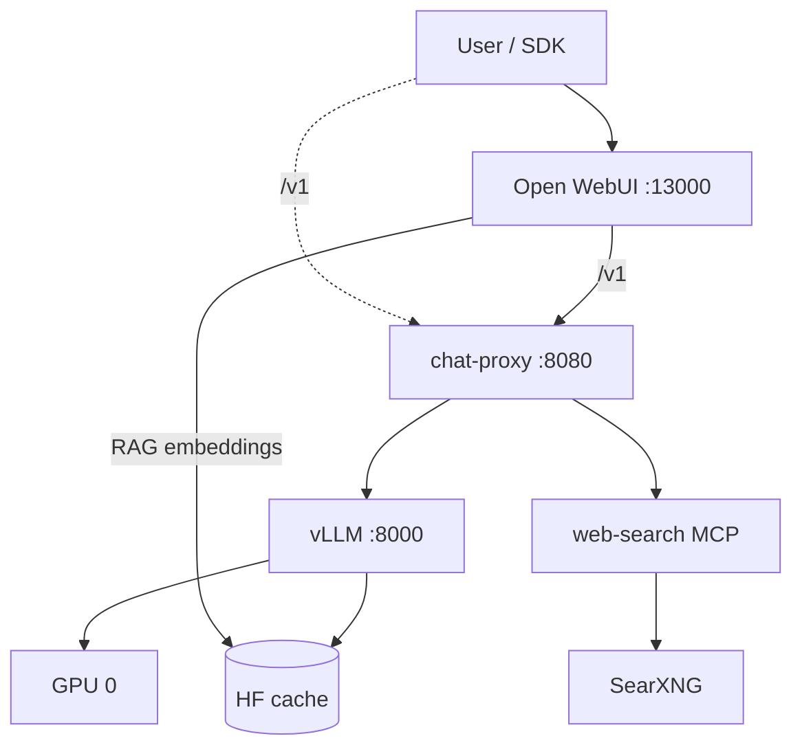

# Architecture

Local GPU stack: **OpenAI-compatible chat-proxy**, **Qwen3-VL** on **vLLM**, **web-search** (MCP), and **Open WebUI**.

## System context

| Layer | Role |
|-------|------|
| **Open WebUI** | Browser UI, sessions, RAG (local embeddings); OpenAI client → proxy |
| **chat-proxy** | Public API: `/v1/chat/completions`, `/v1/models`; system tools, validation, orchestration |
| **vLLM** | Internal inference: VL model, Hermes tool calls, Qwen3 reasoning parser |
| **web-search (MCP HTTP)** | SearXNG + Playwright; MCP tools `search_urls`, `fetch_page_markdown` (logic in `web_search.operations`) |
| **SearXNG** | External metasearch HTTP API |
| **Host** | NVIDIA A100 80GB, Hugging Face cache, Docker Compose |

Users and SDK clients target the **proxy**. vLLM and MCP are not direct public dependencies after plan 02 cutover.

## Target deployment (plan 02)



**Deployed stack:** Open WebUI → chat-proxy → vLLM; web-search via MCP. Streaming: plan 03 (not yet in code). See [plans/01-vllm-migration.md](plans/01-vllm-migration.md), [plans/02-chat-proxy-api.md](plans/02-chat-proxy-api.md).

---

## Chat proxy API

Single public surface: **OpenAI Chat Completions** shape (not full OpenAI Platform).

### Request modes

| Mode | How enabled | Proxy behavior |
|------|-------------|----------------|
| **Plain chat** | No `tools`, no `reasoning.enabled` | Passthrough to vLLM (text + vision messages) |
| **Client functions** | `tools[]` with `type: "function"` only | vLLM → `tool_calls` to client |
| **System web search** | `tools[]` with `type: "web_search"` | Full pipeline on proxy; one final answer |
| **Reasoning** | `reasoning: { "enabled": true }`, no tools | vLLM `enable_thinking`; CoT typically in `content` (passthrough) |

**400 conflicts:**

- `web_search` (or any system tool) + `type: "function"` in the same request.
- `reasoning.enabled` + any `tools`.

### System tool: `web_search`

```json
{
  "type": "web_search",
  "search_context_size": "low" | "medium" | "high",
  "user_location": {
    "type": "approximate",
    "approximate": {
      "country": "RU",
      "city": "Moscow",
      "region": "Moscow",
      "timezone": "Europe/Moscow"
    }
  }
}
```

`user_location` is **required**. v1: one system tool per request.

**Response:** `finish_reason: stop`, `message.content`, `message.annotations[]` with `url_citation` (not client-visible `tool_calls`).

**Pipeline:** router LLM → MCP `search_urls` (10) → LLM URL filter → MCP `fetch_page_markdown` (parallel) → final LLM → citations in `annotations` (non-stream) and OWUI `citation` events + streamed answer (plan 03 stream).

### Client function calling

Standard OpenAI: proxy forwards `tools` to vLLM; returns `tool_calls` / `finish_reason: tool_calls`. Client executes functions and continues with `role: tool`.

### Reasoning (optional)

- Request: `reasoning.enabled: true` → `chat_template_kwargs.enable_thinking: true` on vLLM.
- Response: passthrough from vLLM. On Qwen3-VL-Instruct, chain-of-thought usually appears in `message.content`; `message.reasoning_content` is set only if vLLM exposes a separate `reasoning` field.
- Not combined with tools in v1.
- Clients must **not** send `reasoning_content` in history (400).

### Streaming (plan 03 — target)

| Mode | `stream: true` |
|------|----------------|
| Plain / vision | Passthrough vLLM SSE |
| Client `function` | Passthrough vLLM SSE (`tool_calls` deltas) |
| Reasoning | Passthrough + `enable_thinking` (no tag parsing on proxy) |
| `web_search` | Status + citation SSE events, then passthrough final vLLM stream |

**Current code (plan 02):** `stream: true` → 400 `not_supported`.

**Open WebUI:** Progress and source chips use SSE lines `data: {"event": {"type": "status"|"citation", ...}}` from chat-proxy (not OWUI Admin Web Search middleware). Disable built-in OWUI web search when using proxy `web_search` tool.

Full contract: [plans/02-chat-proxy-api.md](plans/02-chat-proxy-api.md), [plans/03-streaming.md](plans/03-streaming.md).

### Not in plan 02 / 03

- `/v1/responses`, Assistants, Images API
- Multiple system tools per request

---

## vLLM service

| Setting | Value | Notes |
|---------|--------|--------|
| Image | `vllm/vllm-openai:v0.12.0` (`VLLM_IMAGE_TAG`) | CUDA 12.x |
| Model | `Qwen/Qwen3-VL-30B-A3B-Instruct` | VL MoE; hybrid thinking |
| Served name (target) | `qwen3-vl-30b-instruct` | Legacy compose may still use `qwen3-30b-instruct` until plan 02 |
| Context | `max_model_len=32768` | OOM-safe on A100 80GB with vision |
| GPU | `gpu_memory_utilization=0.9`, device `0` | |
| Tool calling | `--enable-auto-tool-choice`, `--tool-call-parser hermes` | Client `function` tools |
| Reasoning | `--reasoning-parser qwen3` (plan 02) | With `enable_thinking` per request |
| Multimodal | `--limit-mm-per-prompt.video 0` recommended | If video not used |

### Tool template (model)

When client `function` tools reach vLLM:

1. System block with `<tools>…</tools>` JSON schemas.
2. Assistant emits `<tool_call>{name, arguments}</tool_call>`.
3. `role: tool` → `<tool_response>…</tool_response>` in template.

Hermes parser maps to OpenAI `tool_calls` on the wire.

---

## System tools and MCP integration bus

SDK clients use **OpenAI Chat API** (`tools[].type`). They do **not** speak MCP directly.

| Class | API | Proxy | Backend |
|-------|-----|-------|---------|
| **System / hosted** | `type: "web_search"`, … | Orchestration + **MCP HTTP client** | Dedicated MCP server per capability |
| **Client** | `type: "function"` | Passthrough | vLLM (Hermes `tool_calls`) |

**Registry (concept):** `web_search` → `WEB_SEARCH_MCP_URL` (e.g. `http://web-search-mcp:8767/mcp`). Future types → other MCP URLs.

**Transport:** streamable **HTTP** only for proxy↔MCP in production (Compose). MCP **stdio** remains for local dev / external MCP clients, not the proxy hot path.

**In-process `operations`:** used inside each MCP server (and optionally by other integrators such as platform pyAPI). **Not** the primary path from chat-proxy to web-search in v1.

---

## web-search module

Copied from the standalone web-search project into this repo (`src/web_search/`):

| Piece | Role |
|-------|------|
| `web_search/operations/` | Reusable scenarios: `search_urls`, `fetch_page_markdown`, … |
| `web_search/adapters/` | SearXNG HTTP, Playwright pool |
| `web_search/core/` | DTOs, config YAML, URL policies |
| `web_search/mcp_servers/` | Thin MCP tool handlers → operations; **HTTP** and stdio entrypoints |

**web-search-mcp** container: Playwright + Chromium + MCP HTTP. **chat-proxy** calls `tools/call` on that server; orchestration stays in proxy.

---

## Environment variables

| Variable | Purpose |
|----------|---------|
| `HF_CACHE_ROOT` | Model weights for vLLM |
| `HF_HUB_CACHE` | Open WebUI RAG embeddings |
| `VLLM_PORT` | Host port → vLLM 8000 (smoke / debug) |
| `VLLM_IMAGE_TAG` | vLLM image tag |
| `VLLM_SERVED_MODEL` | Smoke scripts (target: `qwen3-vl-30b-instruct`) |
| `OPEN_WEBUI_PORT` | UI port |
| `OPENAI_API_KEY` | Dummy for local |
| `RAG_EMBEDDING_MODEL` | e.g. `BAAI/bge-m3` |
| `CHAT_PROXY_PORT` | *(plan 02)* Public proxy port |
| `WEB_SEARCH_*` | *(plan 02)* SearXNG URL, MCP URL, limits |

---

## Smoke tests

| Script | Checks |
|--------|--------|
| `tests/smoke/check_vllm_models.sh` | vLLM `/v1/models` |
| `tests/smoke/check_vllm_tool_calls.sh` | Direct vLLM function calling |
| `run_proxy_contract_smoke.sh` | Proxy contract checks (plain, functions, web_search, vision) |
| *(plan 03)* | Proxy streaming smoke (`curl -N`), OWUI manual |

---

## Related documents

- [INDEX.md](INDEX.md) — file map
- [DECISIONS.md](DECISIONS.md) — decision log
- [PROGRESS.md](PROGRESS.md) — active plan
- [plans/01-vllm-migration.md](plans/01-vllm-migration.md) — completed
- [plans/02-chat-proxy-api.md](plans/02-chat-proxy-api.md) — completed
- [plans/03-streaming.md](plans/03-streaming.md) — active
