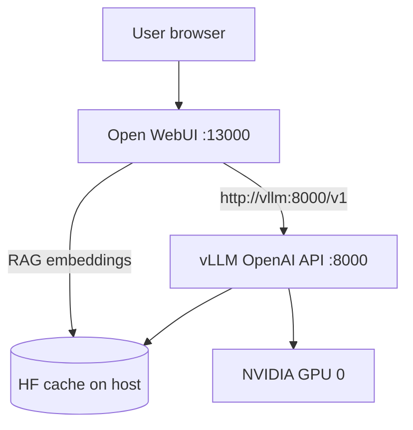

# Architecture

Local GPU stack for chat with **Qwen3** via **native vLLM** (OpenAI API + Hermes tool calling) and **Open WebUI**.

## System context

| Layer | Role |
|-------|------|
| **Open WebUI** | Browser UI, chat sessions, optional RAG (local embeddings), tools/MCP integration via OpenAI API |
| **vLLM** | OpenAI-compatible `/v1` API (chat completions, models list, structured `tool_calls`) |
| **Host** | NVIDIA GPU (A100 80GB), Hugging Face cache on disk, Docker Compose |

Users interact only with Open WebUI. vLLM is an internal dependency on the `chat-ai-stack` Docker network.

## Deployment

- **Compose services:** `vllm` (`vllm/vllm-openai`), `open-webui` (upstream image `v0.6.32`).
- **Model weights:** `Qwen/Qwen3-30B-A3B-Instruct-2507` from host `HF_CACHE_ROOT` (Hugging Face hub cache).
- **Served model id:** `qwen3-30b-instruct` (Open WebUI model selector).

### vLLM service

| Setting | Value | Notes |
|---------|--------|--------|
| Image | `vllm/vllm-openai:v0.12.0` (override via `VLLM_IMAGE_TAG`) | CUDA 12.x runtime; host driver 575 / CUDA 12.9 compatible |
| Model | `Qwen/Qwen3-30B-A3B-Instruct-2507` | MoE ~30.5B total, ~3.3B active; BF16 |
| Served name | `qwen3-30b-instruct` | `--served-model-name` in Compose |
| Context | `max_model_len=32768` | OOM-safe on single A100 80GB |
| GPU memory | `gpu_memory_utilization=0.9` | Single GPU device `0` |
| Tool calling | `--enable-auto-tool-choice`, `--tool-call-parser hermes` | Per Qwen3 function-calling docs |
| Reasoning | *disabled* | Instruct-2507 is non-thinking only |

### Tool-calling protocol (model + vLLM)

The checkpoint ships a chat template that, when `tools` are present:

1. Injects a **# Tools** section and JSON tool schemas inside `<tools>…</tools>`.
2. Expects assistant output as `<tool_call>{"name":…,"arguments":…}</tool_call>`.
3. Maps tool results via `<tool_response>…</tool_response>` (OpenAI `role: tool` messages are folded into the template).

vLLM’s **Hermes** parser converts generated XML/JSON tool segments into OpenAI **`tool_calls`** on the wire. Open WebUI then executes tools/MCP and sends follow-up requests with `tool_call_id`.

**Acceptance:** `finish_reason == "tool_calls"` and non-empty `message.tool_calls` on the first turn; coherent assistant text after tool results on the second turn.

### What stays unchanged

- Open WebUI image and data volume (`open-webui-data`).
- Host paths `HF_CACHE_ROOT`, `HF_HUB_CACHE` for weights and RAG (`BAAI/bge-m3`).
- Docker network `chat-ai-stack`, single GPU `0`, `OPENAI_API_KEY` dummy for local use.
- No Qwen-Agent container required for this architecture (optional future integration).

## Environment variables

| Variable | Default | Purpose |
|----------|---------|---------|
| `HF_CACHE_ROOT` | *(required)* | Host path mounted into vLLM at `/root/.cache/huggingface` |
| `HF_HUB_CACHE` | *(required)* | Hub subtree for Open WebUI RAG embeddings (read-only) |
| `VLLM_PORT` | `19000` | Host port → container `8000` (OpenAI API) |
| `VLLM_IMAGE_TAG` | `v0.12.0` | Pin for `vllm/vllm-openai` image |
| `VLLM_SERVED_MODEL` | `qwen3-30b-instruct` | Model id for smoke scripts (optional) |
| `VLLM_BASE_URL` | `http://127.0.0.1:${VLLM_PORT}/v1` | Override for smoke scripts |
| `OPEN_WEBUI_PORT` | `13000` | Host port for UI |
| `OPENAI_API_KEY` | `dummy` | Passed to Open WebUI and smoke requests |
| `RAG_EMBEDDING_MODEL` | `BAAI/bge-m3` | Local embedding model id |

Compose sets `OPENAI_API_BASE_URL=http://vllm:8000/v1` for Open WebUI (not overridable via `.env` unless you edit `docker-compose.yml`).

## Operator checklist (manual)

After `docker compose up -d` and vLLM healthcheck passes:

1. Run `tests/smoke/check_vllm_models.sh` and `tests/smoke/check_vllm_tool_calls.sh`.
2. Open Open WebUI at `http://localhost:${OPEN_WEBUI_PORT}`, select **qwen3-30b-instruct**.
3. Enable function tools or MCP; confirm the assistant returns structured tool calls (not raw `<tool_call>` XML only in `content`).

## Hardware and deployment assumptions

- **GPU:** NVIDIA A100-SXM4-80GB, one device.
- **Driver:** 575.x (CUDA 12.9 reported by `nvidia-smi`).
- **Disk:** Full model in Hugging Face hub cache (~61 GB BF16 shards).
- **Startup:** Healthcheck `start_period` 900s while MoE weights load.

## Smoke tests

| Script | Checks |
|--------|--------|
| `tests/smoke/check_vllm_models.sh` | `GET /v1/models` includes `qwen3-30b-instruct` |
| `tests/smoke/check_vllm_tool_calls.sh` | `POST /v1/chat/completions` with `tools` → `finish_reason: tool_calls` |

## Future application layer (out of scope for plan 01)

Project rules define a planned Python layout under `src/` (core, operations, adapters, `mcp_servers/`). When added, treat the vLLM OpenAI endpoint as **infrastructure**: sync HTTP client, no business logic in Compose files.

## Related documents

- [INDEX.md](INDEX.md) — file map
- [DECISIONS.md](DECISIONS.md) — decision log
- [PROGRESS.md](PROGRESS.md) — active plan and journal
- [plans/01-vllm-migration.md](plans/01-vllm-migration.md) — migration checklist (completed)
