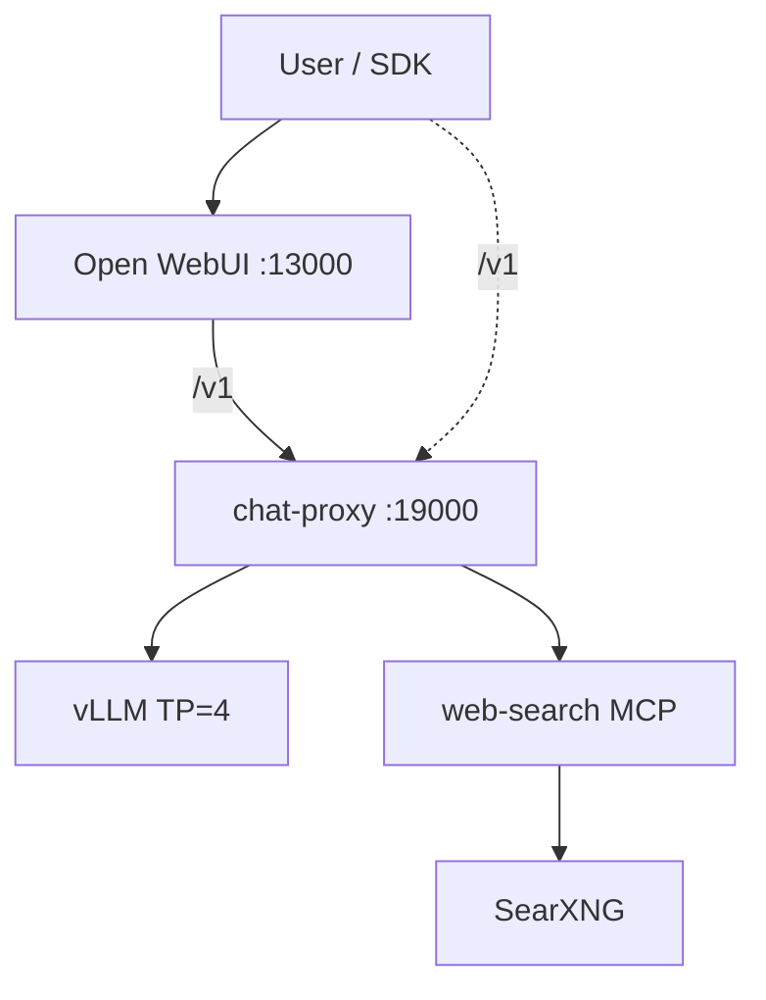

# chat-ai (production)

Self-hosted **OpenAI-compatible chat stack**: FastAPI **chat-proxy** in front of **vLLM** (Qwen3-VL-235B FP8), **hosted web search** (SearXNG + Playwright via MCP), and **Open WebUI** for the browser UI.

Production host: **4× NVIDIA H100**, tensor parallel size 4. Public API and UI on fixed ports; inference and search run inside Docker Compose.

## Highlights

| Area | What it does |
|------|----------------|
| **Unified API** | `POST /v1/chat/completions` and `GET /v1/models` — OpenAI Chat shape |
| **Hosted web search** | `tools: [{ "type": "web_search" }]` — router LLM, SearXNG, URL filter, page fetch, citations |
| **Client tools** | `type: "function"` forwarded to vLLM (Hermes parser → `tool_calls`) |
| **Vision** | Qwen3-VL multimodal messages (`image_url`) |
| **Optional reasoning** | `reasoning.enabled` → `enable_thinking` on vLLM |
| **Streaming** | SSE passthrough for chat/tools/reasoning; status + citation events for web search |

## Architecture



Clients and Open WebUI call **chat-proxy** on port **19000**. vLLM is internal only (`vllm:8000` inside Docker network).

## Stack

| Component | Version / model |
|-----------|-----------------|
| **Inference** | [vLLM](https://docs.vllm.ai/) `v0.12.x`, `Qwen/Qwen3-VL-235B-A22B-Instruct-FP8` |
| **Served model id** | `qwen3-vl-235b-instruct` |
| **Context** | 131072 tokens |
| **Proxy** | Python 3.12, FastAPI |
| **Search** | SearXNG, Playwright, MCP over HTTP |
| **UI** | [Open WebUI](https://github.com/open-webui/open-webui) v0.6.32 |
| **Deploy** | Docker Compose |

## Requirements

- Linux with **4× NVIDIA H100** (GPU 0–3), CUDA 12.x compatible drivers
- Docker Engine + NVIDIA Container Toolkit
- Hugging Face cache on shared storage: `/mnt/artifacts/models/.cache`
- Enough disk space for FP8 VL-235B weights (first start downloads from Hugging Face)

## Paths and ports

| Item | Value |
|------|--------|
| Deploy directory | `/home/triton/chat-ai` |
| Legacy Triton stack | `/home/triton/chat-ai-triton` (backup) |
| HF weights cache | `/mnt/artifacts/models/.cache` |
| HF hub (RAG embeddings) | `/mnt/artifacts/models/.cache/hub` |
| Open WebUI | `http://<host>:13000` |
| Chat API (OpenAI-compatible) | `http://<host>:19000/v1` |
| OWUI data volume | `chat-ai_open-webui` (external, preserves user chats) |

## Environment (`.env`)

Key variables:

```bash
HF_CACHE_ROOT=/mnt/artifacts/models/.cache
HF_HUB_CACHE=/mnt/artifacts/models/.cache/hub
CHAT_PROXY_PORT=19000
OPEN_WEBUI_PORT=13000
VLLM_SERVED_MODEL=qwen3-vl-235b-instruct
SEARXNG_SECRET=<secret>
OPENAI_API_KEY=dummy
RAG_EMBEDDING_MODEL=BAAI/bge-m3
```

## Operations

### Start / stop

```bash
cd /home/triton/chat-ai
docker compose up -d --build
docker compose down          # without -v — keeps OWUI volume
```

### Status and logs

```bash
docker compose ps
docker compose logs -f vllm
docker compose logs -f chat-proxy
```

First vLLM start: Docker image pull, model download, GPU load — can take **30–40+ minutes**.

### Monitor model download

```bash
watch -n 30 'du -sh /mnt/artifacts/models/.cache/hub/models--Qwen--Qwen3-VL-235B-A22B-Instruct-FP8 2>/dev/null || echo "not started"; du -sh /mnt/artifacts/models/.cache/hub'
```

### Health checks

```bash
curl -s http://localhost:19000/v1/models
curl -s http://localhost:19000/health
```

## Open WebUI setup (one-time)

After the stack is healthy:

1. Open `http://<host>:13000` — existing chats should be preserved (`chat-ai_open-webui` volume).
2. **Admin → Settings → Models** — add/use model id **`qwen3-vl-235b-instruct`**.
3. Enable model capabilities: **Citations** and **Status Updates**.
4. **Admin → Functions** — import `open_webui/functions/proxy_web_search_filter.py`.
5. **Disable** Open WebUI built-in Web Search (to avoid duplicate SearXNG with proxy `web_search`).

Plain chat works after vLLM is healthy. Web search in UI works after the Filter is imported and enabled.

## API for clients

| | Value |
|---|--------|
| Base URL | `http://<host>:19000/v1` |
| Model | `qwen3-vl-235b-instruct` |

### Request modes

| Mode | Trigger | Behavior |
|------|---------|----------|
| Plain / vision | No tools | Passthrough to vLLM |
| Functions | `tools[].type == "function"` | vLLM returns `tool_calls` |
| Web search | `tools[].type == "web_search"` | Proxy orchestrates search + answer |
| Reasoning | `reasoning.enabled` | vLLM `enable_thinking` |

`web_search` and `function` tools cannot be mixed in one request (`400 conflicting_tools`).

Example web search tool (`user_location` required):

```json
{
  "type": "web_search",
  "search_context_size": "medium",
  "user_location": {
    "type": "approximate",
    "approximate": {
      "country": "US",
      "city": "New York",
      "region": "New York",
      "timezone": "America/New_York"
    }
  }
}
```

SearXNG locale (`en` / `ru`) is inferred from the user message script (Cyrillic → `ru`, Latin → `en`), not from `user_location`.

## Project layout (production deploy bundle)

| Path | Role |
|------|------|
| `docker-compose.yml` | Full stack definition |
| `Dockerfile.chat-proxy` | Proxy image |
| `Dockerfile.web-search-mcp` | Search MCP + Playwright |
| `src/` | Proxy and web-search application code |
| `config/web_search/` | SearXNG settings, fetch limits |
| `open_webui/functions/` | OWUI Filter for proxy web search |
| `.env` | Host paths, ports, secrets |
