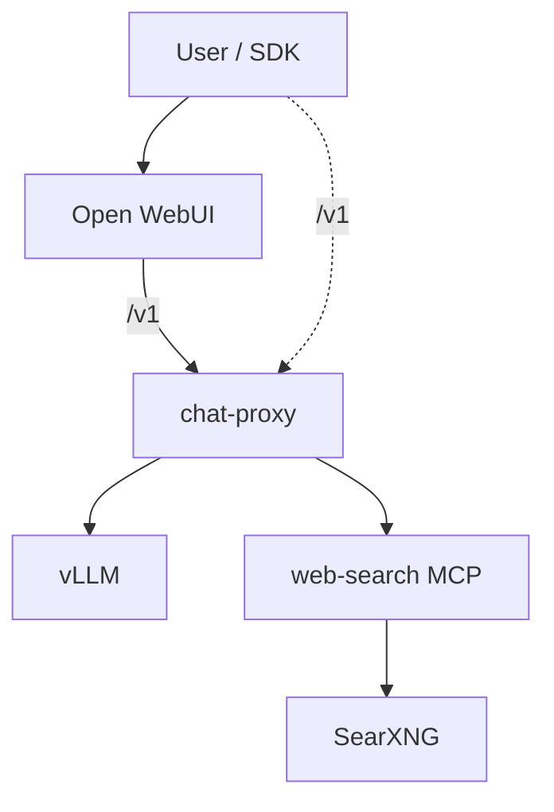

# Reference deployment

Production-oriented guidance for deploying the **chat-ai** self-hosted AI platform. This document describes **deployment patterns** — not one canonical host, model, or hardware layout.

Operators configure model choice, GPU capacity, cache paths, ports, and network exposure for their environment. SDK clients and Open WebUI always target **chat-proxy** as the public API; vLLM, web-search MCP, and SearXNG remain internal.

## Architecture (reference)



| Exposure | Service | Notes |
|----------|---------|--------|
| **Public** | Open WebUI | Browser UI on `OPEN_WEBUI_PORT` |
| **Public** | chat-proxy | `CHAT_PROXY_PORT` → `/v1/chat/completions`, `/v1/models` |
| **Internal** | vLLM | Docker network (`vllm:8000`); local Compose binds debug host port to `127.0.0.1` only |
| **Internal** | web-search MCP, SearXNG | Docker network only; local Compose binds debug host ports to `127.0.0.1` only |

## Stack components

| Component | Role |
|-----------|------|
| **vLLM** | Inference: OpenAI-compatible model API to chat-proxy |
| **chat-proxy** | Public API boundary, validation, web_search orchestration |
| **web-search MCP** | SearXNG + Playwright tools for proxy |
| **SearXNG** | Metasearch backend for MCP |
| **Open WebUI** | Browser UI; OpenAI client pointed at chat-proxy |

Compatibility: **OpenAI Chat Completions-compatible** (`POST /v1/chat/completions`, `GET /v1/models`) — not the full OpenAI Platform.

## Capacity planning

Choose deployment dimensions based on your model and traffic:

| Dimension | Operator decisions |
|-----------|-------------------|
| **Model** | Any vLLM-supported model; vision, reasoning, and tool-calling depend on model family |
| **Context length** | `max_model_len` in vLLM — trades VRAM for long-context use cases |
| **GPU / accelerator** | Single-GPU for smaller models; tensor parallelism (`--tensor-parallel-size`) for large models |
| **VRAM** | Must fit model weights + KV cache at chosen context; use `gpu_memory_utilization` tuning |
| **Storage** | Shared or local HF cache (`HF_CACHE_ROOT`, `HF_HUB_CACHE`) with enough space for weights |
| **Network** | Expose Open WebUI and chat-proxy to users; keep vLLM and search on the Docker network only. Local Compose binds internal debug ports to `127.0.0.1`; reference deployments should remove those host mappings or firewall them |

**Example sizing patterns** (not defaults):

- **Single GPU (~80GB class):** vision-language models in the ~30B parameter range at moderate context (e.g. 32K tokens) — matches local Compose defaults.
- **Multi-GPU tensor parallel:** large models (e.g. 100B+ class) split across 2–8 GPUs with matching `--tensor-parallel-size`.

Adjust `docker-compose.yml` vLLM command flags for your chosen model and hardware.

## Configuration

### Environment (`.env`)

Copy from `.env.example` and set operator-specific values:

```bash
# Cache paths (operator-selected)
HF_CACHE_ROOT=/path/to/huggingface/cache
HF_HUB_CACHE=/path/to/huggingface/cache/hub

# Public service ports
CHAT_PROXY_PORT=18080
OPEN_WEBUI_PORT=13000

# Model (set both for Compose)
VLLM_HF_MODEL=Qwen/Qwen3-VL-30B-A3B-Instruct
VLLM_SERVED_MODEL=your-model-id
# CHAT_PROXY_DEFAULT_MODEL is set from VLLM_SERVED_MODEL in docker-compose.yml

# Secrets
SEARXNG_SECRET=<secret>
OPENAI_API_KEY=dummy   # SDK placeholder; chat-proxy does not enforce auth yet

# Optional
RAG_EMBEDDING_MODEL=BAAI/bge-m3
VLLM_IMAGE_TAG=v0.12.0
```

Internal service URLs (`vllm:8000`, `web-search-mcp:3333/mcp`, `searxng:8080`) are wired in `docker-compose.yml` via `CHAT_PROXY_WEB_SEARCH_MCP_URL` and related settings. Host ports for vLLM, SearXNG, and web-search MCP bind to `127.0.0.1` in the default Compose file for local debug; remove or restrict those mappings in reference deployments.

### Paths and volumes

| Item | Configuration |
|------|---------------|
| HF weights cache | `HF_CACHE_ROOT` — mount into vLLM container |
| HF hub (RAG embeddings) | `HF_HUB_CACHE` — mount into Open WebUI |
| Open WebUI data | Compose volume (preserves chats across restarts) |
| Deploy directory | Any path on the operator's host |

## Operations

### Start / stop

From your deploy directory:

```bash
docker compose up -d --build
docker compose down          # without -v — keeps OWUI volume
```

### Status and logs

```bash
docker compose ps
docker compose logs -f vllm
docker compose logs -f chat-proxy
docker compose logs -f web-search-mcp
```

**First vLLM start:** image pull, model download from Hugging Face, GPU load — can take **30–60+ minutes** depending on model size and network.

### Monitor model download

Track cache growth under your `HF_HUB_CACHE` path, for example:

```bash
watch -n 30 "du -sh ${HF_HUB_CACHE}/hub 2>/dev/null"
```

### Health checks

Verify the **public** API (chat-proxy):

```bash
curl -s http://localhost:${CHAT_PROXY_PORT}/v1/models
curl -s http://localhost:${CHAT_PROXY_PORT}/health
```

Optional debug — direct vLLM (internal):

```bash
curl -s http://localhost:${VLLM_PORT}/v1/models
```

### Request logging

Structured logs on chat-proxy stdout (Docker captures). Each request has a `request_id` for correlation:

```bash
docker logs chat-proxy 2>&1 | grep 'mode=web_search'
```

Set `CHAT_PROXY_LOG_LEVEL=DEBUG` for MCP timing. See [ARCHITECTURE.md](ARCHITECTURE.md#observability-chat-proxy).

## Open WebUI setup (one-time)

After the stack is healthy:

1. Open `http://<your-host>:${OPEN_WEBUI_PORT}`.
2. **Admin → Settings → Models** — add the model id matching `VLLM_SERVED_MODEL`.
3. Enable model capabilities: **Citations** and **Status Updates** (required for proxy web search UX on OWUI v0.6.32).
4. **Admin → Functions** — import `open_webui/functions/proxy_web_search_filter.py`.
5. **Disable** Open WebUI built-in Web Search (Admin → Settings → Web Search) to avoid duplicate SearXNG with proxy `web_search`.

Plain chat works after vLLM is healthy. Web search in the UI works after the Filter is imported and enabled. Full setup: [open_webui/README.md](../open_webui/README.md).

## API for clients

| | Value |
|---|--------|
| Base URL | `http://<your-host>:${CHAT_PROXY_PORT}/v1` |
| Model | Value of `VLLM_SERVED_MODEL` |
| Auth | chat-proxy does **not** enforce API keys. `Authorization: Bearer` in SDK examples is a compatibility placeholder. Place chat-proxy behind a gateway or reverse proxy for authenticated reference deployments |

Use the OpenAI SDK with `base_url` pointing at chat-proxy — not at vLLM directly.

### Request modes

| Mode | Trigger | Behavior |
|------|---------|----------|
| Plain / vision | No tools | Passthrough to vLLM |
| Functions | `tools[].type == "function"` | vLLM returns `tool_calls` |
| Web search | `tools[].type == "web_search"` | Proxy orchestrates search + answer |
| Reasoning | `reasoning.enabled` | vLLM `enable_thinking` |

**Limitations:** `web_search` and `function` tools cannot be mixed (`400 conflicting_tools`). No Assistants, Images, Files, or `/v1/responses` APIs.

Example web search tool (`user_location` required):

```json
{
  "type": "web_search",
  "search_context_size": "medium",
  "user_location": {
    "type": "approximate",
    "approximate": {
      "country": "US",
      "city": "New York",
      "region": "New York",
      "timezone": "America/New_York"
    }
  }
}
```

SearXNG locale (`en` / `ru`) is inferred from the user message script, not from `user_location`.

## Web search setup

Proxy `web_search` requires:

1. **web-search-mcp** and **SearXNG** healthy in Compose.
2. `CHAT_PROXY_WEB_SEARCH_MCP_URL` reachable from chat-proxy (default `http://web-search-mcp:3333/mcp` in Compose).
3. For Open WebUI: Filter imported, built-in Web Search disabled, Citations + Status Updates enabled on the model.

Smoke check: `./tests/smoke/check_proxy_web_search.sh` (from repo root, with `.env` loaded).

## Deploy bundle layout

| Path | Role |
|------|------|
| `docker-compose.yml` | Full stack definition |
| `Dockerfile.chat-proxy` | Proxy image |
| `Dockerfile.web-search-mcp` | Search MCP + Playwright |
| `src/` | Proxy and web-search application code |
| `config/web_search/` | SearXNG settings, fetch limits |
| `open_webui/functions/` | OWUI Filter for proxy web search |
| `.env` | Operator paths, ports, secrets |

## Related documentation

- [ARCHITECTURE.md](ARCHITECTURE.md) — component boundaries, request flows, compatibility
- [examples/python/README.md](../examples/python/README.md) — SDK client examples against chat-proxy
- [tests/smoke/README.md](../tests/smoke/README.md) — contract smoke tests
