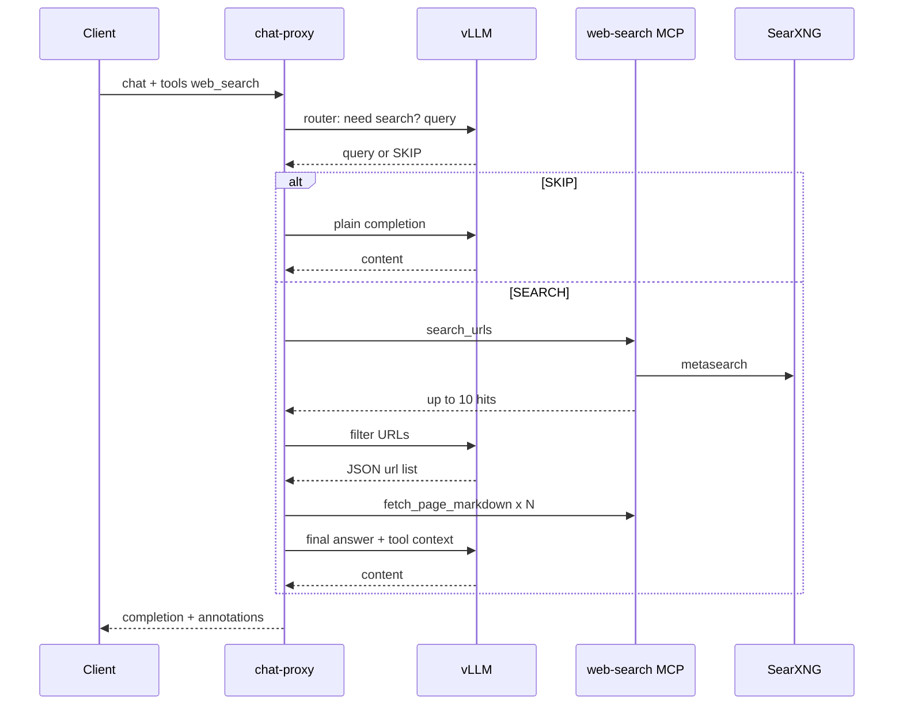

# Plan 02 — OpenAI Chat Proxy, web search, VL inference

**Status:** Active (documentation approved 2026-05-26).  
**Goal:** Add `chat-proxy` with OpenAI-compatible `POST /v1/chat/completions`, system `web_search`, client function calling, optional reasoning; embed web-search; point Open WebUI at the proxy.

**References:** [DECISIONS.md](../DECISIONS.md), [ARCHITECTURE.md](../ARCHITECTURE.md), [Qwen3-VL-30B-A3B-Instruct](https://huggingface.co/Qwen/Qwen3-VL-30B-A3B-Instruct), [Qwen thinking / enable_thinking](https://qwen.readthedocs.io/en/latest/getting_started/quickstart.html), [vLLM reasoning outputs](https://docs.vllm.ai/en/latest/features/reasoning_outputs/).

---

## 1. API contract (public)

### Endpoints

- `GET /v1/models` — passthrough to vLLM (model list / aliases).
- `POST /v1/chat/completions` — all logic below.
- Other OpenAI routes — **404** or not implemented in v1.

### Mode detection

| Condition | Mode |
|-----------|------|
| `tools` contains `type: "web_search"` (or future system `type`) | **System tool** (orchestrated on proxy) |
| `tools` contains only `type: "function"` | **Client functions** (vLLM + Hermes) |
| Neither | **Plain chat** (passthrough to vLLM) |

**400 `conflicting_tools`:** system tool + `type: "function"` in the same request.

**400 `conflicting_reasoning`:** `reasoning.enabled: true` + any `tools` entry.

### System tool: `web_search`

**Request example:**

```json
{
  "model": "qwen3-vl-30b-instruct",
  "messages": [{ "role": "user", "content": "What changed in vLLM 0.4.0?" }],
  "tools": [{
    "type": "web_search",
    "search_context_size": "medium",
    "user_location": {
      "type": "approximate",
      "approximate": {
        "country": "RU",
        "city": "Moscow",
        "region": "Moscow",
        "timezone": "Europe/Moscow"
      }
    }
  }]
}
```

**Validation:**

- Missing `user_location` → 400 `missing_required_parameter`.
- More than one system tool in v1 → 400.

**Response:**

- `finish_reason: "stop"`.
- `message.content` — final answer (may include human-readable source list).
- `message.annotations[]` — `type: "url_citation"`, `url_citation: { url, title, start_index, end_index }` (OpenAI-style; indices may be `0` if inline citations not computed).
- No `tool_calls` for this mode.

### Client function calling

**Request:** standard OpenAI `tools: [{ "type": "function", "function": { name, description, parameters } }]`.

**Response:** `message.tool_calls`, `message.content: null`, `finish_reason: tool_calls`.

**Follow-up:** client sends `role: tool` + `tool_call_id`; proxy passthrough to vLLM (no system tools in same request).

### Optional reasoning

**Request:**

```json
{
  "reasoning": { "enabled": true },
  "messages": [{ "role": "user", "content": "..." }]
}
```

Proxy → vLLM `chat_template_kwargs: { "enable_thinking": true }`.

**Response:** passthrough from vLLM. On Qwen3-VL-Instruct, chain-of-thought usually appears in `message.content` only. If vLLM returns a separate `reasoning` field, the proxy maps it to `reasoning_content` (no tag parsing or content splitting).

```json
"message": {
  "role": "assistant",
  "content": "..."
}
```

**Not allowed:** `reasoning` / `reasoning_content` on input `messages` (400).

### Plain chat

- Text and multimodal `messages` (OpenAI `image_url` / content parts) forwarded to vLLM.
- No `tools`, no `reasoning.enabled`.

### Streaming

- v1: `stream: true` → **400** or **501** with clear message.

---

## 2. Web search pipeline (internal)



| Step | Action |
|------|--------|
| 0 | Router LLM: search needed? `query` + `language` (from `user_location`) or SKIP |
| 1 | MCP `search_urls`, `max_results=10` |
| 2 | LLM filter: pick 3–5 URLs from snippets (`temperature=0`) |
| 3 | Parallel `fetch_page_markdown`; truncate per `search_context_size` budget |
| 4 | Final LLM with history + synthetic tool turn (`role: tool` content); cite sources |
| 5 | Build `annotations` from fetched URLs |

**`search_context_size` budgets** (configure in proxy, tune in implementation):

| Size | URL cap after filter | Per-URL markdown budget (indicative) |
|------|----------------------|--------------------------------------|
| `low` | 3 | smaller |
| `medium` | 4–5 | default (~10k chars equivalent) |
| `high` | 5–6 | larger |

---

## 3. Application structure (`src/`)

| Layer | Responsibility |
|-------|----------------|
| `src/adapters/vllm_inference.py` | `InferencePort`: chat completions to vLLM |
| `src/adapters/mcp_tool_client.py` | Generic MCP HTTP `tools/call` (streamable HTTP) |
| `src/core/system_tool_registry.py` | Map `tools[].type` → MCP base URL + orchestrator |
| `src/operations/chat_completion.py` | Route modes, validate, orchestrate |
| `src/operations/web_search_pipeline.py` | Steps 0–5; calls MCP `search_urls` / `fetch_page_markdown` |
| `src/operations/reasoning_fallback.py` | Map vLLM `reasoning` → `reasoning_content` if present |
| `src/web_search/` | Embedded web-search: `operations` + `mcp_servers` (HTTP server) |
| `src/main.py` or `src/adapters/http_api.py` | FastAPI OpenAI routes |

**Integration rule:** proxy **orchestrates**, MCP servers **execute** tool primitives. `web_search.operations` is not imported on the proxy hot path in v1 (stays inside **web-search-mcp**; reusable in-process elsewhere).

**Future system tool:** add MCP server to Compose, register `type` in `system_tool_registry`, implement orchestrator (or single composite MCP tool if appropriate).

Onion layout per `.cursor/rules/02-architecture-standards.mdc`.

---

## 4. Docker Compose (target)

```text
open-webui → chat-proxy:8080/v1
chat-proxy → vllm:8000/v1
chat-proxy → web-search-mcp:PORT/mcp
web-search-mcp → searxng
vllm → GPU, HF cache
```

**vLLM command additions (plan 02 implementation):**

- Model: `Qwen/Qwen3-VL-30B-A3B-Instruct`
- `--served-model-name qwen3-vl-30b-instruct`
- `--tool-call-parser hermes`
- `--reasoning-parser qwen3`
- `--limit-mm-per-prompt.video 0` (if no video in v1)
- Optional text-only internal calls: document when to pass image limit 0

**New services:** `chat-proxy`, `web-search-mcp`, `searxng` (from copied web-search compose fragments).

**Env:** `CHAT_PROXY_PORT`, `WEB_SEARCH_MCP_URL`, `SEARXNG_BASE_URL`, `VLLM_*` (internal).

---

## 5. Implementation checklist

### 5.1 Repository and web-search

- [ ] Copy web-search into `src/web_search/` + `config/web_search/` + `tests/web_search/`
- [ ] Refactor imports to `web_search.*` (avoid clash with proxy `src/core/`)
- [ ] Merge `pyproject.toml` / workspace deps (playwright, httpx, mcp, …)
- [ ] Add Compose: `searxng`, `web-search-mcp` (HTTP `/mcp`), healthchecks
- [ ] Document `WEB_SEARCH_*` env vars in ARCHITECTURE

### 5.2 Proxy core

- [ ] FastAPI app: `GET /v1/models`, `POST /v1/chat/completions`
- [ ] Request validation: tool mode, conflicts, required `user_location`
- [ ] `VllmInferenceAdapter` (`InferencePort`)
- [ ] `McpToolClient` + `system_tool_registry` (extensible beyond `web_search`)
- [ ] Plain chat + multimodal message passthrough
- [ ] Client function mode: passthrough + normalize `tool_calls`

### 5.3 Web search

- [ ] `WebSearchOrchestrator` (pipeline steps 0–5) via **MCP HTTP** (`search_urls`, `fetch_page_markdown`)
- [ ] Response builder: `content` + `annotations` (`url_citation`)
- [ ] Timeouts suitable for long pipeline (document for clients)

### 5.4 Reasoning

- [ ] Request field `reasoning.enabled` → `chat_template_kwargs`
- [ ] Passthrough response; map vLLM `reasoning` → `reasoning_content` when present
- [ ] Reject reasoning fields in input messages

### 5.5 Integration

- [ ] vLLM: `--reasoning-parser qwen3`, served name `qwen3-vl-30b-instruct`
- [ ] Open WebUI `OPENAI_API_BASE_URL` → `http://chat-proxy:…/v1`
- [ ] Smoke: models, function tool_calls, web_search (mock MCP or live), vision

### 5.6 Documentation

- [x] DECISIONS, ARCHITECTURE, INDEX, PROGRESS, this plan
- [ ] Update smoke script model id after served-name change

---

## 6. Acceptance criteria

1. **Client functions:** `tools: [function]` → valid `tool_calls`; second turn with `role: tool` returns assistant text.
2. **Web search:** `tools: [web_search]` + required `user_location` → single response, `stop`, non-empty `content`, `annotations` with at least one `url_citation` when search ran.
3. **Conflict:** `web_search` + `function` in one request → 400.
4. **Reasoning:** `reasoning.enabled: true`, no tools → completion with `enable_thinking` (CoT typically in `content`); not mixed with tools.
5. **Open WebUI:** chat and (if configured) image message via proxy to VL model.
6. **Migration:** SDK clients change only `base_url` to proxy; model id `qwen3-vl-30b-instruct`.

---

## 7. Out of scope (plan 02)

- `/v1/responses`, Assistants API, embeddings, images API.
- Streaming.
- Multiple system tools per request.
- Second and later MCP servers beyond web-search (registry design only).
- Proxy in-process calls to `web_search.operations` (optional optimization later).
- MCP stdio between proxy and tools in production.
- `stream` and `parallel_tool_calls` edge cases beyond defaults.
- Quantization / multi-GPU.
