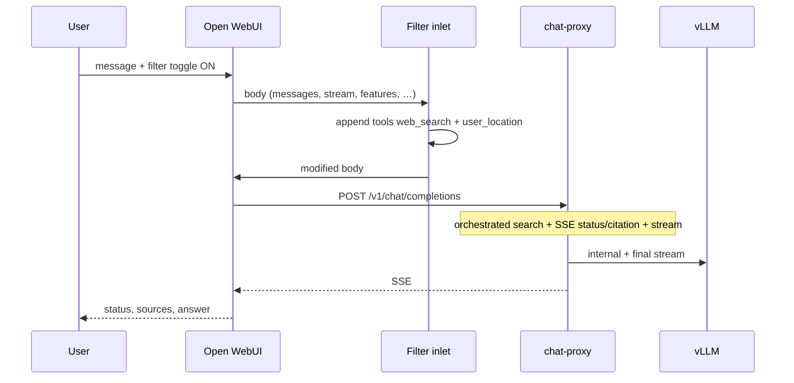

# Plan 04 — Open WebUI: inject proxy `web_search` (Filter)

**Status:** Active (documentation approved 2026-05-26).  
**Goal:** Let Open WebUI users trigger **chat-proxy** hosted `web_search` from the chat UI without changing OWUI source code and without enabling search for every API call.

**Prerequisites:** Plan 02 (proxy `web_search` pipeline), Plan 03 (streaming + OWUI SSE status/citation for orchestrated search).  
**References:** [DECISIONS.md](../DECISIONS.md), [ARCHITECTURE.md](../ARCHITECTURE.md), [02-chat-proxy-api.md](02-chat-proxy-api.md), [03-streaming.md](03-streaming.md), [Open WebUI Filter](https://docs.openwebui.com/features/extensibility/plugin/functions/filter/).

---

## 1. Problem

- Open WebUI → `OPENAI_API_BASE_URL` → chat-proxy sends normal `messages` + `stream: true` by default.
- Proxy runs `web_search` **only** when the request includes `tools: [{ "type": "web_search", "user_location": ... }]`.
- Built-in **Admin → Web Search** in OWUI uses OWUI middleware + SearXNG **before** the model call; it does **not** call proxy `web_search` (duplicate stack, different UX).
- Result today: streaming works; UI chat has no search unless the client sends the tool explicitly (smoke scripts do).

Same as connecting **real OpenAI**: hosted search is **opt-in per request** via `tools`, not automatic for every chat.

---

## 2. Decisions summary

| Topic | Decision |
|-------|----------|
| OWUI integration | **Filter Function** (`inlet`) — no fork of `open-webui` |
| When to inject | When the filter runs (user enabled filter on chat), optionally gated on `features.web_search` (valve) |
| API clients | Unchanged — inject only if they send `tools` themselves |
| Built-in OWUI Web Search | **Disable** globally when using this filter (avoid double SearXNG) |
| Default location | Valves on filter (e.g. RU / Saint Petersburg) — required by proxy contract |
| Conflicts | Do not inject if `tools` already has `web_search` or any `function` tool (400 on proxy) |
| Delivery | Filter source in repo `open_webui/functions/`; install via OWUI Admin import |

---

## 3. Request flow (target)



OWUI strips `features`, `metadata`, etc. before the HTTP call to proxy; **`tools` is forwarded**.

---

## 4. Filter contract

### 4.1 Behavior (`inlet`)

1. If `tools` already contains `type: "web_search"` → return body unchanged.
2. If `tools` contains any `type: "function"` → return unchanged (avoid `conflicting_tools`).
3. If valve `require_web_search_feature` is true and `features.web_search` is not true → return unchanged.
4. Else append one system tool:

```json
{
  "type": "web_search",
  "search_context_size": "<valve>",
  "user_location": {
    "type": "approximate",
    "approximate": {
      "country": "<valve>",
      "city": "<valve>",
      "region": "<valve>",
      "timezone": "<valve>"
    }
  }
}
```

5. Return modified `body`.

Filter class: `toggle = True` so OWUI shows a per-chat toggle ([Filter docs](https://docs.openwebui.com/features/extensibility/plugin/functions/filter/)).

### 4.2 Valves (defaults)

| Valve | Default | Notes |
|-------|---------|--------|
| `country` | `RU` | |
| `city` | `Saint Petersburg` | |
| `region` | `Leningrad Oblast` | |
| `timezone` | `Europe/Moscow` | |
| `search_context_size` | `medium` | `low` \| `medium` \| `high` |
| `require_web_search_feature` | `false` | If `true`, inject only when `body.features.web_search` is set (OWUI Web Search chat toggle) |

### 4.3 OWUI admin setup

1. **Disable** Admin → Settings → **Web Search** (global OWUI search off).
2. **Functions** → import Filter from `open_webui/functions/proxy_web_search_filter.py`.
3. **Models** → `qwen3-vl-30b-instruct` → add filter to **Filters** list.
4. **Chat** → enable **Proxy Web Search** filter toggle for the session.

Optional: enable model **Web Search** capability + valve `require_web_search_feature=true` to tie injection to OWUI’s Web Search icon instead of only the filter toggle.

---

## 5. Implementation checklist

### 5.1 Repository

- [ ] `open_webui/functions/proxy_web_search_filter.py` — OWUI Filter (self-contained `inlet`, no repo imports in sandbox)
- [ ] `open_webui/inject_web_search.py` — shared inject logic for unit tests
- [ ] `open_webui/README.md` — install and verify steps
- [ ] `tests/test_owui_inject_web_search.py` — inject helper tests

### 5.2 Documentation (this wave)

- [x] `docs/plans/04-open-webui-web-search-filter.md`
- [x] `docs/DECISIONS.md`, `ARCHITECTURE.md`, `INDEX.md`, `PROGRESS.md`

### 5.3 Operator verification

- [ ] Filter imported and bound to model
- [ ] Built-in OWUI Web Search off
- [ ] Chat with filter on: news query → proxy status + streamed answer + sources
- [ ] Direct API without `tools`: no search (regression)
- [ ] `./tests/smoke/check_proxy_web_search.sh` still passes

---

## 6. Acceptance criteria

1. With filter enabled in chat, proxy receives `tools: [web_search]` with valid `user_location`.
2. User sees search progress and citations (plan 03 SSE) and streamed answer.
3. With filter off, plain chat unchanged (no spurious search).
4. API clients calling proxy directly are unaffected unless they send `web_search` themselves.
5. No double search when built-in OWUI Web Search is disabled.

---

## 7. Out of scope (plan 04)

- Forking or patching `open-webui` image
- Auto-inject `web_search` on **every** proxy request (API or UI)
- Replacing SearXNG with OWUI-only search as the primary path
- `POST /api/v1/chats/.../event` from chat-proxy (no chat/message headers on OpenAI connection)
- Auto-loading functions via deprecated `FUNCTIONS_DIR` (OWUI DB import only)
