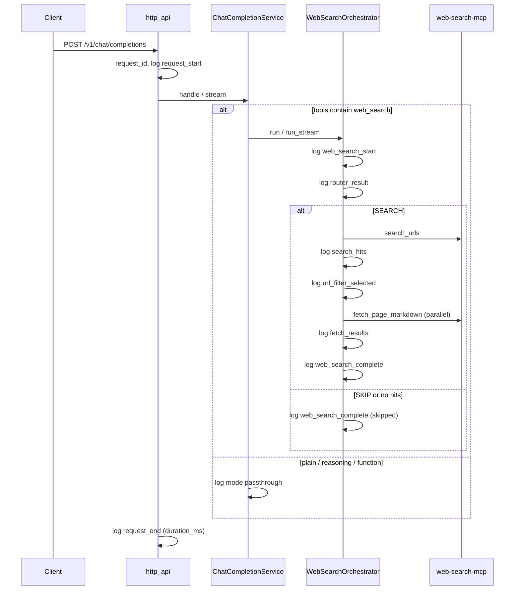

# Plan 05 — chat-proxy structured logging

**Status:** Active (documentation approved 2026-05-26).  
**Goal:** Observable **chat-proxy** logs so operators can see request mode, whether **web_search** ran, and pipeline details (router, SearXNG hits, selected URLs, fetch outcomes) without relying on Open WebUI or browser DevTools.

**Prerequisites:** Plans 02–04 (proxy API, streaming, OWUI filter).  
**References:** [DECISIONS.md](../DECISIONS.md), [ARCHITECTURE.md](../ARCHITECTURE.md), [02-chat-proxy-api.md](02-chat-proxy-api.md), [04-open-webui-web-search-filter.md](04-open-webui-web-search-filter.md).

---

## 1. Problem

- Today chat-proxy emits only **uvicorn access logs** (`POST /v1/chat/completions`); no application-level detail.
- **web_search** orchestration (router → MCP `search_urls` → URL filter → `fetch_page_markdown` → final LLM) is silent in `docker logs chat-proxy`.
- Operators cannot answer: *Was `web_search` in the request? Did the router SKIP? Which URLs were returned and selected? Did fetch succeed?*
- Plan 04 verification relied on UI (**Citations** / **Status Updates**), smoke scripts, and manual Network inspection.

---

## 2. Decisions summary

| Topic | Decision |
|-------|----------|
| Library | Python **`logging`** stdlib (no new runtime dependency) |
| Scope (v1) | **chat-proxy** only (`src/adapters`, `src/operations`, `src/core`); not OWUI, not vLLM, not web-search-mcp in this wave |
| Format | Default **human-readable** lines; optional **`CHAT_PROXY_LOG_JSON=true`** for one JSON object per log record (Loki/Docker-friendly) |
| Level | `CHAT_PROXY_LOG_LEVEL` (default `INFO`; `DEBUG` for verbose MCP timing) |
| Correlation | **`request_id`** (UUID) per `POST /v1/chat/completions`; propagate on all log records for that request |
| Privacy | **Do not** log full `messages`, page **markdown**, or API keys; log **URL lists**, counts, model id, tool types, router query (short) |
| web_search visibility | One summary line per request: `web_search invoked=yes|no`; when yes, structured **stage** lines (see §4) |
| Passthrough modes | Log **mode** at request start: `plain`, `reasoning`, `function`, `web_search`; no per-token logging |
| Errors | Log MCP/vLLM failures at **ERROR** with `request_id` and stage; validation 4xx at **INFO** or **WARNING** |
| Startup | Log bind URL, `default_model`, `web_search_mcp_url` once at INFO |
| Tests | Unit tests with `caplog` for key web_search branches (SKIP, no hits, success); no log snapshot files |
| Out of scope (v1) | OpenTelemetry/traces; request/response body dump; logging inside embedded `web_search` MCP server; OWUI filter logs |

---

## 3. Request flow (logging touchpoints)



---

## 4. Log events (web_search — required fields)

All web_search lines use logger name `chat_proxy.web_search` (or shared `chat_proxy` with `extra={"component":"web_search"}`). Every line includes **`request_id`**.

| Event | Level | When | Key fields |
|-------|-------|------|------------|
| `request_start` | INFO | Entry to chat completions | `request_id`, `model`, `stream`, `mode`, `tool_types[]` |
| `web_search_start` | INFO | Orchestrator entered | `search_context_size`, `searxng_language`, `budget_max_urls` |
| `router_result` | INFO | After router LLM | `action` (`SEARCH` \| `SKIP`), `query` (truncated 200 chars), `language` |
| `search_hits` | INFO | After MCP `search_urls` | `query`, `hit_count`, `urls` (ordered list from SearXNG, max 10) |
| `search_no_hits` | INFO | Zero results | `query` → then plain/vLLM fallback (same as today) |
| `url_filter_result` | INFO | After URL filter LLM | `selected_urls`, `fallback_used` (bool: top-N from hits when filter empty) |
| `fetch_results` | INFO | After parallel fetch | `requested_urls`, `fetched_urls`, `failed_urls` |
| `web_search_complete` | INFO | End of orchestration | `outcome`: `skip` \| `no_hits` \| `success`, `pages_fetched`, `duration_ms` (pipeline only) |
| `request_end` | INFO | Response finished / stream closed | `request_id`, `mode`, `status` (`ok` \| `error`), `duration_ms` |

**Operator cheat sheet — “did web search run?”**

- `mode=web_search` + `web_search_start` → tool was in request and orchestrator started.
- `router_result action=SKIP` → MCP search **not** called; no URLs.
- `search_hits` → SearXNG returned URLs (listed).
- `url_filter_result` → which URLs were chosen for fetch.
- `fetch_results` → which URLs actually produced markdown.

---

## 5. Log events (non–web_search)

| Event | Level | Fields |
|-------|-------|--------|
| `request_start` | INFO | `mode`: `plain` \| `reasoning` \| `function` |
| `request_end` | INFO | `duration_ms` |
| `validation_error` | WARNING | `code`, `param` (no message body) |
| `upstream_error` | ERROR | `stage` (`vllm` \| `mcp`), `tool` or path, exception type/message |

No logging of reasoning content or function `tool_calls` payloads in v1.

---

## 6. Implementation layout

| Path | Purpose |
|------|---------|
| `src/core/logging_config.py` | `configure_logging(settings)` — level, JSON vs text formatter, uvicorn log level alignment |
| `src/core/settings.py` | `log_level: str`, `log_json: bool` |
| `src/core/request_context.py` | `contextvars` for `request_id`; context manager or middleware helper |
| `src/adapters/http_api.py` | Assign `request_id`; `request_start` / `request_end`; call `configure_logging` in lifespan |
| `src/operations/chat_completion.py` | Log mode routing once |
| `src/operations/web_search_pipeline.py` | Stage logs (§4) |
| `src/adapters/mcp_tool_client.py` | DEBUG: tool name + duration_ms (optional v1) |
| `.env.example` | `CHAT_PROXY_LOG_LEVEL`, `CHAT_PROXY_LOG_JSON` |
| `docker-compose.yml` | Document env for `chat-proxy` service (optional default) |

**JSON record shape (when `LOG_JSON=true`):**

```json
{
  "timestamp": "...",
  "level": "INFO",
  "logger": "chat_proxy.web_search",
  "message": "search_hits",
  "request_id": "...",
  "hit_count": 10,
  "urls": ["https://..."]
}
```

---

## 7. Implementation checklist

### 7.1 Core

- [ ] `logging_config.py` + settings fields
- [ ] `request_context.py` + middleware/wrapper in `http_api`
- [ ] Startup log line in FastAPI lifespan

### 7.2 web_search pipeline

- [ ] `web_search_start`, `router_result`, `search_hits` / `search_no_hits`
- [ ] `url_filter_result`, `fetch_results`, `web_search_complete`
- [ ] Shared helper to truncate query strings and cap URL list length in logs

### 7.3 Routing & errors

- [ ] `chat_completion.py`: mode + `tool_types` on entry
- [ ] Log validation errors and upstream MCP/vLLM failures

### 7.4 Tests & docs

- [ ] `tests/test_web_search_logging.py` (caplog: SKIP path, hits path)
- [ ] `tests/test_request_logging.py` (plain vs web_search mode line)
- [ ] Update `open_webui/README.md` troubleshooting (point to `docker logs chat-proxy`)
- [ ] Update `ARCHITECTURE.md` observability subsection

### 7.5 Operator verification

- [ ] `docker compose up` → one plain chat → `request_start mode=plain`, no `web_search_*`
- [ ] OWUI chat with Proxy Web Search → `mode=web_search`, full stage lines, URLs visible
- [ ] Router SKIP question → `action=SKIP`, no `search_hits`
- [ ] `CHAT_PROXY_LOG_LEVEL=DEBUG` shows MCP tool timing

---

## 8. Acceptance criteria

1. Every chat completion log line for a given HTTP request shares the same **`request_id`**.
2. From logs alone, operator can tell **whether `web_search` was requested** and **whether MCP search ran** (vs router SKIP / no hits).
3. For a successful search, logs list **SearXNG URLs** and **selected/fetched URLs** without opening the UI.
4. No full user message bodies or fetched markdown in default INFO logs.
5. Existing smoke tests still pass; new unit tests cover logging helpers.

---

## 9. Out of scope (plan 05)

- Structured logging in **web-search-mcp** / SearXNG / vLLM containers
- Access log replacement (keep uvicorn access logs)
- Metrics/Prometheus
- Persisting logs to files inside container (stdout only; Docker captures)
