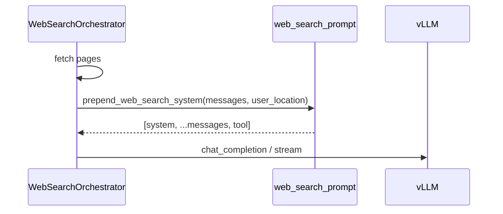

# Plan 06 — web_search temporal grounding (system prompt)

**Status:** Planned (documentation 2026-05-26; implementation pending).  
**Goal:** Stop the final LLM from rejecting fetched web results as “from the future” when source dates are newer than the model’s training-time notion of “today”. Inject an **English** system prompt with the **real current date** on the proxy, only for the **web_search final answer** step.

**Prerequisites:** Plans 02–04 (web_search pipeline), plan 05 (logging).  
**References:** [DECISIONS.md](../DECISIONS.md), [ARCHITECTURE.md](../ARCHITECTURE.md), [02-chat-proxy-api.md](02-chat-proxy-api.md).

---

## 1. Problem

- Operator verification (OWUI + logs): search and fetch succeed (`SEARCH`, `search_hits`, `fetch_results`, `outcome=success`), but the **final answer** claims recent news is fake because publication dates (e.g. `2026-05-26`) are “in the future” relative to an internal **May 2025** “today”.
- Root cause: `_final_answer` / `_final_stream_body` pass user `messages` + a `role: tool` block with page markdown; there is **no** system instruction anchoring calendar time or telling the model to trust tool results over stale cutoff assumptions.
- This is **not** a SearXNG or MCP bug; it is missing **temporal grounding** on the final vLLM call.
- User-facing answers that lecture about “future dates” are unacceptable for a web-search product.

---

## 2. Decisions summary

| Topic | Decision |
|-------|----------|
| Where | **chat-proxy** only — final LLM step after fetch, not router, not URL filter, not plain/reasoning/function modes |
| Language | **English** for all new prompt strings (project standard: prompts, comments, docs in English; user/UI language may be anything) |
| Date source | `datetime` at request time; format **ISO 8601** date (and optional time) in the prompt |
| Timezone | Prefer `user_location.approximate.timezone` (IANA, e.g. `Europe/Moscow`); fallback **UTC** if missing or invalid |
| Message shape | Prepend a single `role: system` message before existing `messages` for the final completion only (non-stream and stream) |
| Tool body | Optional v1.1: prepend `retrieved_at` line to `tool_content` — **not required** for plan 06 v1 if system prompt is sufficient |
| OWUI | No reliance on per-model system prompts in Admin for correctness; proxy owns grounding for `web_search` |
| Config | No new env vars in v1; date is always “now” (no injected fake dates) |
| Tests | Unit test: final `messages` include system prompt with today’s date; mock timezone from `user_location` |
| Out of scope | Changing model weights; post-filtering assistant text; translating prompts per user locale |

---

## 3. Prompt contract (English, v1)

Helper e.g. `build_web_search_system_prompt(*, now: datetime, timezone: str) -> str`.

**Must include:**

1. **Explicit today** — e.g. `Today's date is 2026-05-26 (timezone Europe/Moscow).`
2. **Trust tool results** — web search output in the following `tool` message is current factual context from the live web.
3. **Do not reject by year** — do not dismiss sources as fake or “from the future” only because their publication dates are after your training knowledge cutoff; the provided date above is authoritative for “now”.
4. **Answer from sources** — summarize what the sources support; say when evidence is insufficient.

**Example (illustrative; implement as one constant or template in code):**

```text
Today's date is {date_iso} (timezone {timezone}).

You will receive web search results in a tool message below. Treat them as current factual context from the live web, not as hypothetical or futuristic fiction.

Your training data may be outdated. Do not claim that source publication dates are "from the future" or that news is fake solely because dates are later than your internal assumptions about the current year. The date line above is authoritative for what "today" means.

Answer the user's question using the provided sources. If the sources do not support a confident answer, say so clearly.
```

Router and URL-filter prompts stay unchanged (English JSON tasks only).

---

## 4. Implementation layout

| Path | Purpose |
|------|---------|
| `src/operations/web_search_prompt.py` *(new)* | `resolve_timezone(user_location) -> str`; `build_web_search_system_prompt(now, tz) -> str`; `prepend_web_search_system(messages, user_location) -> list` |
| `src/operations/web_search_pipeline.py` | Use helper in `_final_answer` and `_final_stream_body`; pass `user_location` (already on orchestrator `run` / `run_stream`) |
| `tests/test_web_search_system_prompt.py` *(new)* | Frozen `now` + sample `user_location` → expected substring in system content |
| `docs/ARCHITECTURE.md` | One paragraph under `web_search` pipeline |
| `docs/DECISIONS.md` | Decision entry (appended) |

**Flow (final step only):**



---

## 5. Implementation checklist

### 5.1 Core

- [ ] `web_search_prompt.py` with timezone resolution (`zoneinfo.ZoneInfo`, fallback UTC)
- [ ] `build_web_search_system_prompt` (English template)
- [ ] `prepend_web_search_system` — insert system as **first** message; do not duplicate if already present (v1: always prepend one proxy system message; document that OWUI system prompts may stack)

### 5.2 Pipeline

- [ ] `_final_answer`: `messages=prepend_web_search_system(messages, user_location)`
- [ ] `_final_stream_body`: same
- [ ] SKIP / no-hits paths unchanged (no system inject when no tool results)

### 5.3 Tests & docs

- [ ] Unit tests for prompt text and timezone fallback
- [ ] Optional: extend web_search smoke with assertion on answer not containing “future” heuristics — fragile; prefer unit tests
- [ ] Update ARCHITECTURE observability / web_search subsection

### 5.4 Operator verification

- [ ] OWUI: news query with dates in sources → answer cites facts, no “we are in 2025” / “fake future news”
- [ ] Logs: unchanged pipeline stages; no new PII in logs (do not log full system prompt at INFO unless DEBUG and short)

---

## 6. Acceptance criteria

1. Final web_search completion (stream and non-stream) includes a **system** message with **today’s date** and English grounding rules.
2. Timezone in the prompt reflects `user_location.approximate.timezone` when valid.
3. Plain chat and router/URL-filter calls are **unchanged** (no extra system message).
4. Operator scenario (Iran / breaking news): model uses fetched content instead of rejecting it as temporally impossible.
5. Existing smoke tests still pass after implementation.

---

## 7. Out of scope (plan 06)

- Localized system prompts per user message language
- OWUI-only system prompt as primary fix
- Injecting date into router or URL-filter LLM calls
- `retrieved_at` in tool body (optional follow-up)
- vLLM / model card “knowledge cutoff” configuration
